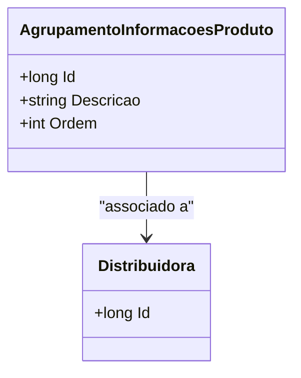

# AgrupamentoInformacoesProduto
**Namespace**: IsthmusWinthor.Dominio.Entidades  
**Nome do Arquivo**: AgrupamentoInformacoesProduto.cs  

## Visão Geral e Responsabilidade
A classe `AgrupamentoInformacoesProduto` representa uma entidade do domínio responsável por agrupar informações relacionadas a produtos, facilitando a organização e visualização das características desses produtos. Ela é fundamental para o gerenciamento eficiente de informações no contexto de uma distribuidora, permitindo que as informações sejam organizadas de acordo com uma descrição e uma ordem específica.

## Métodos de Negócio
*Nota: Esta classe não contém métodos de negócio que apresentem lógica condicional complexa. Portanto, o item a seguir está vazio e não haverá visualizações de fluxos.*

## Propriedades Calculadas e de Validação
*Nota: Esta classe não possui propriedades que contenham lógica no `get` ou validação no `set`.*

## Navigations Property
- [Distribuidora](Distribuidora.md) - Representa a distribuidora associada a este agrupamento de informações.

## Tipos Auxiliares e Dependências
*Nota: Esta classe não utiliza Enumeradores ou Classes Estáticas/Helpers que precisem ser listadas.*

## Diagrama de Relacionamentos

---
Gerada em 29/12/2025 20:15:29
