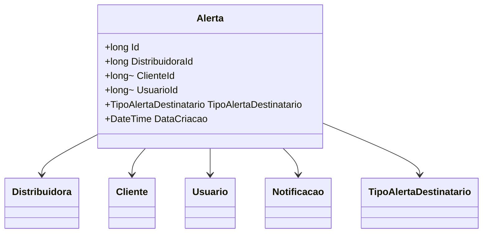

# Alerta

**Namespace**: `IsthmusWinthor.Dominio.Entidades`  
**Nome do Arquivo**: `Alerta.cs`  

---

> A classe `Alerta` é um componente de domínio chave que opera como uma Raiz de Agregado no contexto de gerenciamento de alarmes e notificações dentro do sistema.

## Visão Geral e Responsabilidade
A classe `Alerta` atua como uma Raiz de Agregado central no sistema de gerenciamento de notificações, que orquestra alertas associados a clientes, usuários ou distribuidores. Seu principal objetivo é consolidar e gerenciar as informações relevantes para a criação de notificações destinadas a diferentes destinatários dentro do sistema, assegurando que os alertas sejam corretamente relacionados às suas respectivas entidades de domínio.

## Métodos de Negócio
Não há métodos complexos incluídos na classe para serem documentados nesta seção. O foco da classe está principalmente em suas propriedades de navegação e associação com outras entidades do domínio.

## Propriedades Calculadas e de Validação
Atualmente, não há propriedades calculadas ou que possuem validação novas implementadas em getters/setters dentro da classe `Alerta`.

## Navigations Property
- **Distribuidora**: Um link para a entidade Distribuidora associada. [Distribuidora](Distribuidora.md)
- **Cliente**: Um link opcional para a entidade Cliente associada. [Cliente](Cliente.md)
- **Usuario**: Um link opcional para a entidade Usuario associada. [Usuario](Usuario.md)
- **Notificacoes**: Uma coleção de Notificacoes relacionadas ao alerta. [Notificacao](Notificacao.md)

## Tipos Auxiliares e Dependências
- **TipoAlertaDestinatario**: Enumeração utilizada para distinguir os tipos de destinatários de alerta. [TipoAlertaDestinatario](TipoAlertaDestinatario.md)

## Diagrama de Relacionamentos

> Este diagrama de classes destaca a(s) inter-relação(ões) da classe `Alerta` com suas propriedades de navegação e dependências relacionadas. Ele serve como uma referência visual para entender como a classe `Alerta` se insere no contexto geral do sistema.
