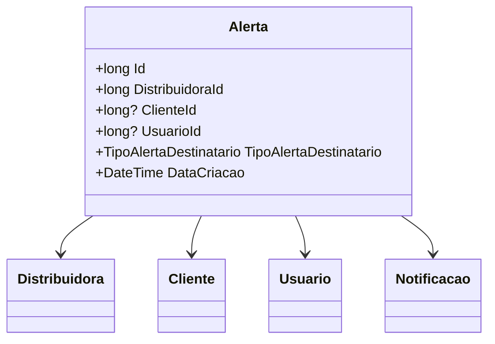

# Alerta
**Namespace**: IsthmusWinthor.Dominio.Entidades  
**Nome do Arquivo**: Alerta.cs  

## Visão Geral e Responsabilidade
A classe `Alerta` representa um sistema de notificações e alertas dentro de uma aplicação voltada para a gestão de relacionamento com o cliente. Ela é responsável por armazenar informações sobre alertas que podem ser enviados a clientes ou usuários relacionados a uma distribuidora específica. Este modelo é crucial para o envio de informações relevantes, permitindo à empresa notificar clientes e gerenciar interações de forma eficiente.

## Métodos de Negócio
Não existem métodos de negócio complexos nesta classe que mereçam destaque.

## Propriedades Calculadas e de Validação
Não existem propriedades com lógica de cálculo no `get` ou validação no `set` nesta classe.

## Navigations Property
- [Distribuidora](Distribuidora.md)
- [Cliente](Cliente.md)
- [Usuario](Usuario.md)
- [Notificacao](Notificacao.md)

## Tipos Auxiliares e Dependências
- [TipoAlertaDestinatario](TipoAlertaDestinatario.md)

## Diagrama de Relacionamentos

---
Gerada em 29/12/2025 20:15:33
