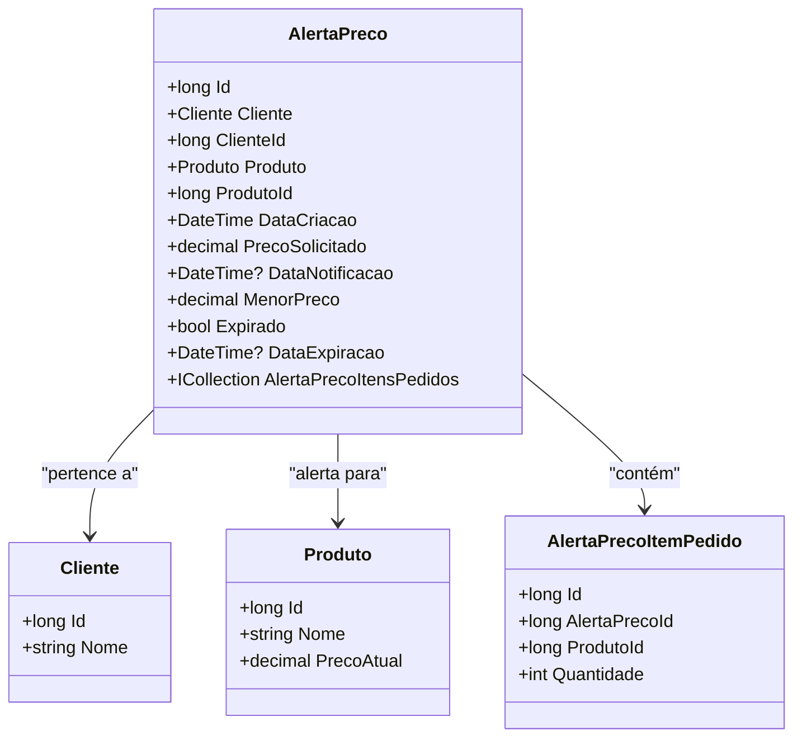

# AlertaPreco
**Namespace**: IsthmusWinthor.Dominio.Entidades  
**Nome do Arquivo**: AlertaPreco.cs  

## Visão Geral e Responsabilidade
A classe `AlertaPreco` representa a entidade encarregada de gerenciar alertas de preços para produtos solicitados por clientes. Seu objetivo é permitir que os clientes sejam notificados quando o preço de um produto atinge um determinado nível, facilitando a tomada de decisões de compra informadas. Este mecanismo não apenas melhora a experiência do cliente, mas também potencializa as vendas ao garantir que os compradores sejam alertados sobre oportunidades de menor preço.

## Métodos de Negócio
Atualmente, a classe `AlertaPreco` não possui métodos com lógica de negócios complexa implementados além dos getters e setters simples. Assim, não há detalhes adicionais para serem fornecidos neste momento.

## Propriedades Calculadas e de Validação
- **PrecoSolicitado**: Esta propriedade representa o preço que o cliente está disposto a pagar por um produto. Não possui lógica de cálculo ou validação adicional.
- **Expirado**: Esta propriedade indica se o alerta de preço está expirado, que deve ser calculado em relação à `DataExpiracao`.
- **DataNotificacao**: Propriedade que deve ser validada para assegurar que a notificação seja agendada apenas se o preço for alcançado antes da expiração.

## Navigations Property
- [Cliente](Cliente.md): Representa o cliente que fez o pedido do alerta de preço.
- [Produto](Produto.md): Representa o produto para o qual o alerta de preço foi criado.
- [AlertaPrecoItemPedido](AlertaPrecoItemPedido.md): Representa os itens de pedido associados ao alerta de preço.

## Tipos Auxiliares e Dependências
- **Enums**: Nenhum enumerador específico identificado nesta classe.
- **Classes Estáticas/Helpers**: Nenhum helper identificado nesta classe.

## Diagrama de Relacionamentos

---
Gerada em 29/12/2025 20:15:50
