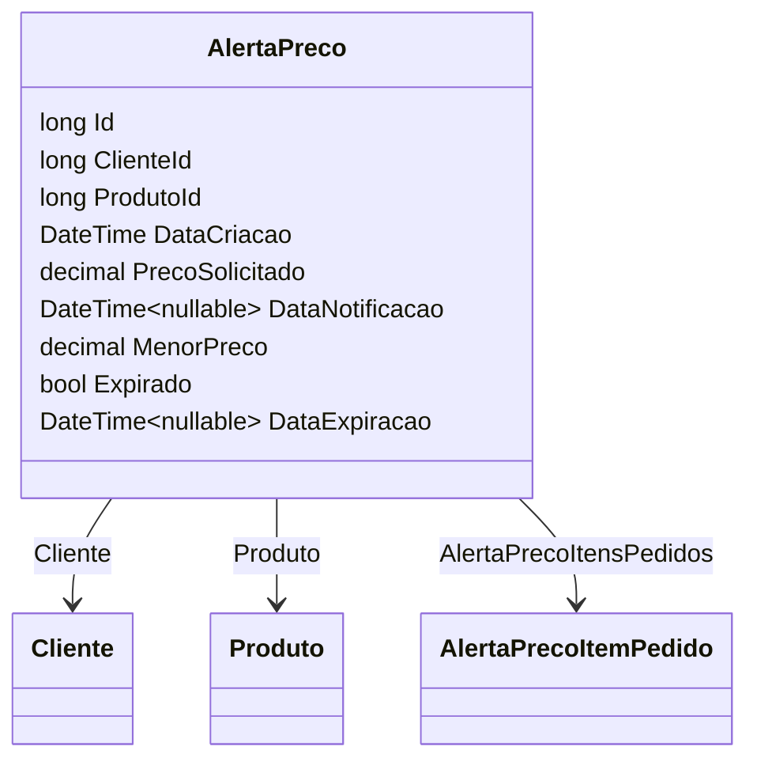

# AlertaPreco

**Namespace**: IsthmusWinthor.Dominio.Entidades  
**Nome do Arquivo**: AlertaPreco.cs  

> Esta classe serve como um modelo de domínio rico que gerencia alertas de preços, envolvendo lógica de estado para determinar expiração e notificações de preços.

## Visão Geral e Responsabilidade
A classe `AlertaPreco` atua como a raiz do agregado para o monitoramento de preços desejados pelos clientes. Seu papel é facilitar a criação de alertas de preço para produtos específicos, notificando clientes quando há uma variação nos preços. Ela gerencia a lógica para identificar quando um alerta de preço está expirado e mantém um registro de todas as tentativas de pedidos associados ao alerta.

## Métodos de Negócio
A classe atualmente não possui métodos públicos complexos que executem lógica de negócio além das propriedades automáticas e validação de integridade básica.

## Propriedades Calculadas e de Validação
Atualmente, a classe não possui propriedades com lógica de cálculo no `get` ou validação no `set`. As propriedades automáticas são usadas para representar os dados de um alerta de preço.

## Navigations Property
- [Cliente](Cliente.md)  
- [Produto](Produto.md)  
- [AlertaPrecoItemPedido](AlertaPrecoItemPedido.md)  

## Tipos Auxiliares e Dependências
- Nenhum tipo auxiliar (Enums/Helpers) é utilizado diretamente pela classe.

## Diagrama de Relacionamentos

