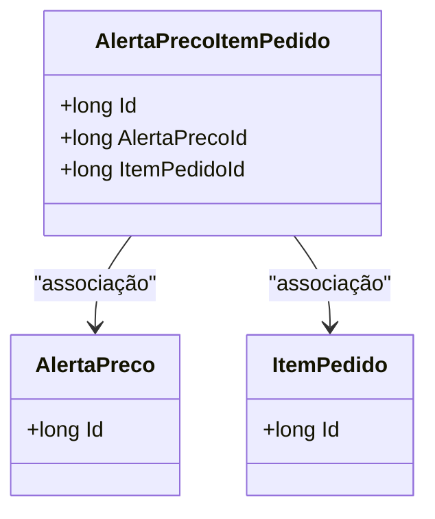

# AlertaPrecoItemPedido
**Namespace**: IsthmusWinthor.Dominio.Entidades  
**Nome do Arquivo**: AlertaPrecoItemPedido.cs  

## Visão Geral e Responsabilidade
A classe `AlertaPrecoItemPedido` representa a relação entre um alerta de preço e um item de pedido na camada de domínio do sistema. Essa classe é crucial para gerenciar as notificações de preços de itens dentro de um pedido, garantindo que os usuários sejam informados sobre alterações significativas nos preços dos produtos que têm interesse ou que estão comprando.

## Métodos de Negócio
Esta classe não possui métodos com lógica de negócio, pois atua como um mapeamento entre os elementos do domínio (Alertas de Preço e Itens de Pedido).

## Propriedades Calculadas e de Validação
Não existem propriedades com lógica no `get` ou validação no `set` nesta classe.

## Navigation Property
- [AlertaPreco](AlertaPreco.md)
- [ItemPedido](ItemPedido.md)

## Tipos Auxiliares e Dependências
- Não há enumeradores ou classes auxiliares utilizadas nesta classe.

## Diagrama de Relacionamentos

---
Gerada em 29/12/2025 20:15:56
