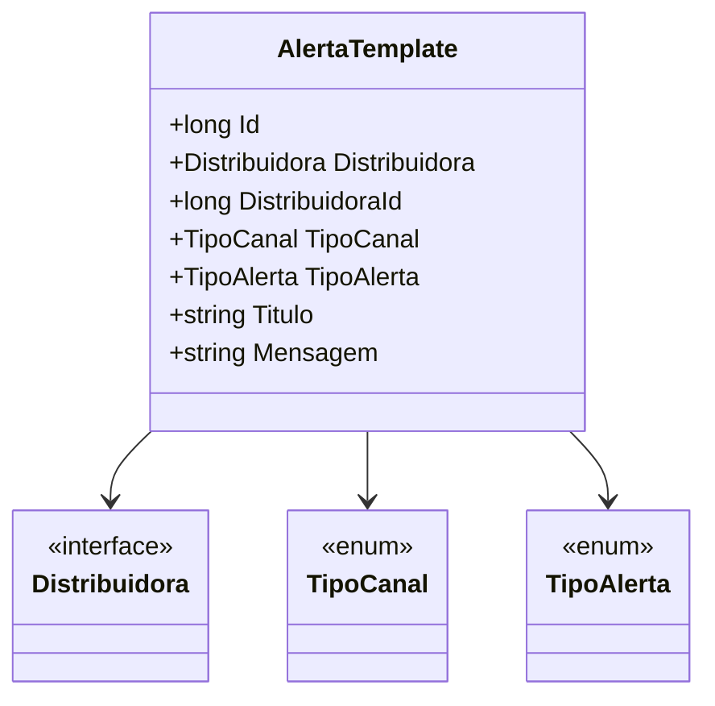

# AlertaTemplate
**Namespace**: IsthmusWinthor.Dominio.Entidades  
**Nome do Arquivo**: AlertaTemplate.cs  

## Visão Geral e Responsabilidade
A classe `AlertaTemplate` representa um modelo de domínio que é responsável pela configuração e manipulação de templates de alertas dentro do sistema. O problema de negócio que esta classe resolve é a necessidade de padronização e gerenciamento de alertas enviados a distribuidoras, garantindo que a comunicação seja clara, consistente e configurável de acordo com o canal e tipo de alerta específico.

## Propriedades Calculadas e de Validação
Não existem propriedades com lógica de cálculo ou validação complexa no `get` ou `set` nesta classe.

## Navigations Property
- **Distribuidora**: [Distribuidora](Distribuidora.md)

## Tipos Auxiliares e Dependências
- **Enumeradores**:
  - [TipoCanal](TipoCanal.md)
  - [TipoAlerta](TipoAlerta.md)

## Diagrama de Relacionamentos

---
Gerada em 29/12/2025 20:16:02
