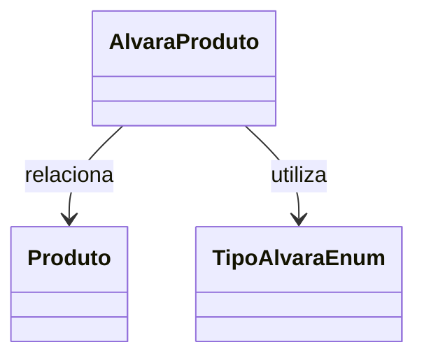

# AlvaraProduto
**Namespace**: IsthmusWinthor.Dominio.Entidades  
**Nome do Arquivo**: AlvaraProduto.cs  

## Visão Geral e Responsabilidade
A classe `AlvaraProduto` representa a entidade que relaciona os produtos a um alvará específico dentro do sistema. Seu papel é garantir que as informações pertinentes ao alvará, como código, descrição e validade, estejam devidamente integradas e possam ser críticas conforme a necessidade do processo de negócios. Isso ajuda a assegurar que apenas produtos que atendem a certos critérios de conformidade estejam disponíveis para operações, mitigando riscos legais e operacionais.

## Métodos de Negócio
Esta classe não possui métodos com lógica de negócios significativos, sendo composta principalmente por propriedades.

## Propriedades Calculadas e de Validação
- **CriticaNumeroDocumento**: Esta propriedade é um indicador que determina se a validação do número do documento é obrigatória. Se `true`, isso significa que a lógica de negócio pode exigir um controle mais rígido sobre os números dos documentos associados.
- **CriticaValidade**: Similar à propriedade anterior, indica se a validade do alvará deve ser considerada nas operações. Um valor `true` implica que produtos sem validade adequada não poderão ser utilizados ou aprovados.
- **Obrigatorio**: Indica se a presença do alvará é obrigatória para o produto em questão. Esta propriedade assegura que não sejam realizados processos com produtos que não cumprem essa regra, ajudando a manter a conformidade regulatória.

## Navigations Property
- [Produto](Produto.md): Representa a classe que contém as informações do produto relacionado ao alvará.

## Tipos Auxiliares e Dependências
- [TipoAlvaraEnum](TipoAlvaraEnum.md): Enum que categoriza os tipos de alvarás disponíveis no sistema.

## Diagrama de Relacionamentos

---
Gerada em 29/12/2025 20:16:11
