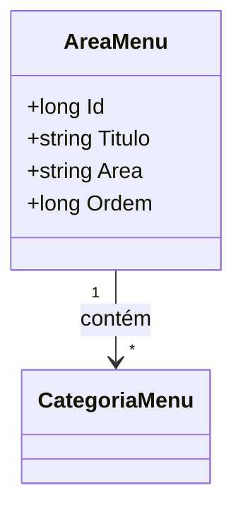

# AreaMenu
**Namespace**: IsthmusWinthor.Dominio.Entidades  
**Nome do Arquivo**: AreaMenu.cs  

## Visão Geral e Responsabilidade
A classe `AreaMenu` representa uma seção de um menu de navegação dentro de um sistema. O papel desta classe é organizar as categorias de menu em diferentes áreas, permitindo uma melhor estruturação da interface do usuário. Ela resolve o problema de categorizar os itens do menu, garantindo uma navegação intuitiva e hierárquica.

## Métodos de Negócio
*Nenhum método de negócio notável foi identificado além dos getters e setters simples.*

## Propriedades Calculadas e de Validação
*Nenhuma propriedade com lógica de cálculo ou validação foi identificada.*

## Navigations Property
- [CategoriaMenu](CategoriaMenu.md) - Propriedade que representa as categorias associadas ao menu.

## Tipos Auxiliares e Dependências
Nenhum enumerador ou classe estática utilizada foi identificada.

## Diagrama de Relacionamentos

---
Gerada em 29/12/2025 20:16:16
