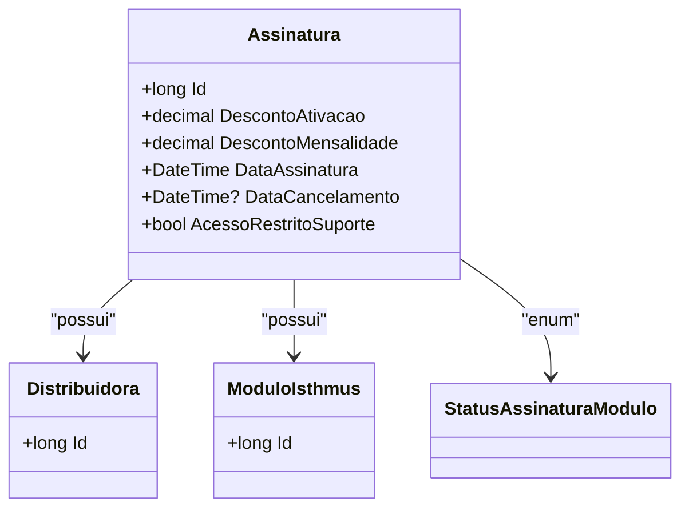

# Assinatura
**Namespace**: IsthmusWinthor.Dominio.Entidades  
**Nome do Arquivo**: Assinatura.cs  

## Visão Geral e Responsabilidade
A classe `Assinatura` representa o contratuado entre uma `Distribuidora` e um `ModuloIsthmus`, gerenciando informações cruciais como descontos de ativação e mensalidade, além do status da assinatura. O problema de negócio que essa classe resolve é a necessidade de controle e rastreamento das assinaturas, permitindo que a aplicação gerencie eficientemente os acessos e condições das distribuidoras.

## Métodos de Negócio
Não foram encontrados métodos com lógica de negócio complexa dentro da classe `Assinatura`, apenas propriedades de dados.

## Propriedades Calculadas e de Validação
Não existem propriedades com cálculos ou validações diretas na classe `Assinatura`. Todas as propriedades são setadas e retornadas diretamente.

## Navigation Properties
- [Distribuidora](Distribuidora.md)
- [ModuloIsthmus](ModuloIsthmus.md)

## Tipos Auxiliares e Dependências
- [StatusAssinaturaModulo](StatusAssinaturaModulo.md)

## Diagrama de Relacionamentos

---
Gerada em 29/12/2025 20:16:24
