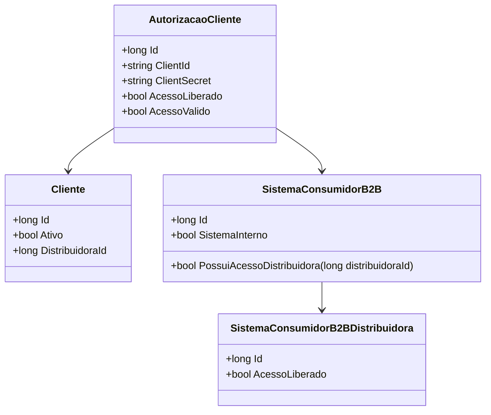

# AutorizacaoCliente
**Namespace**: IsthmusWinthor.Dominio.Entidades  
**Nome do Arquivo**: AutorizacaoCliente.cs  

## Visão Geral e Responsabilidade
A classe `AutorizacaoCliente` representa a autorização de um cliente em relação a um sistema consumidor B2B. Ela tem a responsabilidade de validar se um cliente tem acesso a operações específicas em um sistema baseado em certas regras de negócio. Este modelo é crucial para garantir que apenas clientes autorizados possam interagir com serviços que requerem tal autorização, minimizando o risco de acessos não autorizados.

## Métodos de Negócio
### Método: `AcessoValido` (Propriedade)
- **Objetivo**: Garante que o acesso de um cliente a um sistema consumidor seja validado com base em regras de negócio específicas.
- **Comportamento**: 
  1. Verifica se o `AcessoLiberado` é verdadeiro.
  2. Confirma que o cliente está ativo (`Cliente.Ativo`).
  3. Chama o método `PossuiAcessoDistribuidora` da classe `SistemaConsumidorB2B` para checar se a distribuidora do cliente possui acesso liberado.
- **Retorno**: Retorna um booleano indicando se o acesso do cliente é válido (`true`) ou não (`false`), baseado na validação das condições acima.

```mermaid
flowchart TD
    A[AcessoLiberado == true] -->|Sim| B[Cliente.Ativo == true]
    A -->|Não| C[Acesso é inválido]
    B -->|Sim| D[SistemaConsumidorB2B.PossuiAcessoDistribuidora()]
    B -->|Não| C
    D -->|Sim| E[Acesso é válido]
    D -->|Não| C
```

## Propriedades Calculadas e de Validação
### Propriedades
- **AcessoValido**: Acesso é considerado válido se o `AcessoLiberado` é verdadeiro, o cliente está ativo e a distribuidora do cliente tem acesso liberado.

## Navigation Property
- **Cliente**: `[Cliente](Cliente.md)` — Referencia à classe que representa os dados do cliente.
- **SistemaConsumidorB2B**: `[SistemaConsumidorB2B](SistemaConsumidorB2B.md)` — Referencia a classe que representa o sistema consumidor B2B.

## Tipos Auxiliares e Dependências
- **Enums e Classes Auxiliares**:
  - `[SistemaConsumidorB2BDistribuidora](SistemaConsumidorB2BDistribuidora.md)` — Utilizada para controles de acesso.

## Diagrama de Relacionamentos


Esta documentação fornece uma visão clara das regras de negócio que a classe `AutorizacaoCliente` implementa, assegurando que a integridade dos dados e as operações de acesso sejam geridas de forma eficaz.
