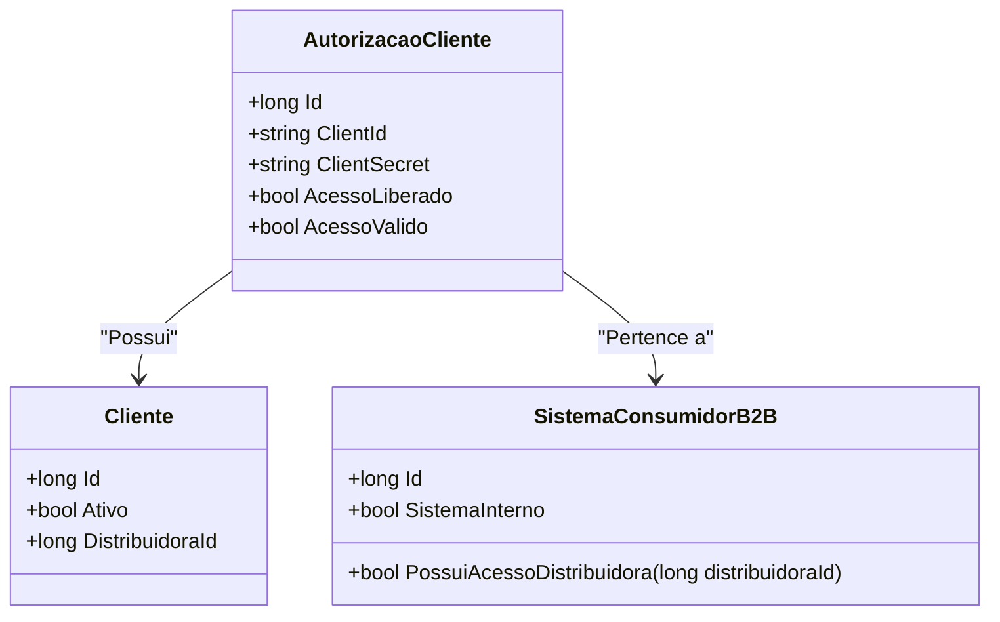

# AutorizacaoCliente
**Namespace**: IsthmusWinthor.Dominio.Entidades  
**Nome do Arquivo**: AutorizacaoCliente.cs  

## Visão Geral e Responsabilidade
A classe `AutorizacaoCliente` representa uma autorização concedida a um cliente por um sistema consumidor em um contexto B2B. Ela tem a responsabilidade de gerenciar e validar o acesso de um cliente a recursos específicos com base em diversas regras de negócio. Através desta classe, o sistema garante que apenas clientes ativos e devidamente autorizados consigam acessar funcionalidades sensíveis, preservando a segurança e a integridade dos dados.

## Métodos de Negócio
### Título: `AcessoValido` (Visibilidade: Public)
- **Objetivo**: Garante que o acesso ao sistema é concedido somente se determinadas condições forem atendidas, promovendo a integridade dos dados e adequação de acesso.
- **Comportamento**: 
    1. Verifica se `AcessoLiberado` é verdadeiro.
    2. Confirma se o `Cliente` está ativo (`Cliente.Ativo`).
    3. Utiliza o método `PossuiAcessoDistribuidora` do `SistemaConsumidorB2B` para verificar se há acesso liberado baseado na distribuidora do cliente.
- **Retorno**: Retorna um valor booleano (`true` ou `false`) que indica se o cliente possui acesso válido ao sistema.

```mermaid
flowchart TD
    A[AcessoLiberado == true] -->|Sim| B[Cliente.Ativo == true]
    A -->|Não| C[Retorna false]
    B -->|Sim| D[SistemaConsumidorB2B.PossuiAcessoDistribuidora(Cliente.DistribuidoraId)]
    B -->|Não| C
    D -->|Sim| E[Retorna true]
    D -->|Não| C
```

## Propriedades Calculadas e de Validação
- **AcessoValido**: Esta propriedade calcula se um cliente tem acesso ao sistema com base nas seguintes regras:
  - O cliente deve ser ativo.
  - O acesso deve estar liberado.
  - O sistema consumidor deve ter acesso à distribuidora vinculada ao cliente ou a distribuidora deve ter acesso liberado.

## Navigation Properties
- [Cliente](Cliente.md)
- [SistemaConsumidorB2B](SistemaConsumidorB2B.md)

## Tipos Auxiliares e Dependências
- Nenhum tipo auxiliar ou enum específico é utilizado diretamente nesta classe.

## Diagrama de Relacionamentos

---
Gerada em 29/12/2025 20:16:38
