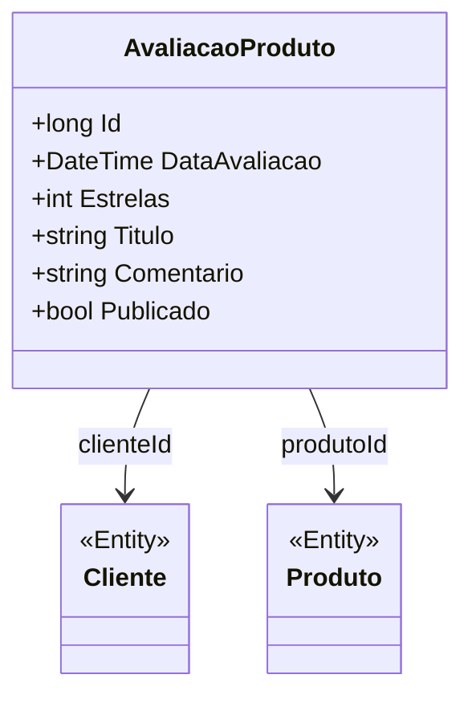

# AvaliacaoProduto

**Namespace**: IsthmusWinthor.Dominio.Entidades  
**Nome do Arquivo**: AvaliacaoProduto.cs

## Visão Geral e Responsabilidade
A classe `AvaliacaoProduto` representa a avaliação de um produto realizada por um cliente. Ela desempenha um papel crucial na coleta de feedback sobre produtos, permitindo que os clientes deixem suas opiniões e notas, influenciando assim futuras decisões de compra. Essa avaliação pode impactar diretamente a reputação do produto no mercado e a satisfação do cliente, sendo uma parte vital do ciclo de vida do produto e de suas vendas.

## Métodos de Negócio
Nesta implementação não existem métodos com lógica de negócio complexa, portanto, não há detalhes a serem fornecidos nesta seção.

## Propriedades Calculadas e de Validação
Não foram identificadas propriedades que contenham lógica de cálculo ou validação complexa.

## Navigations Property
- `Cliente`: Representa a entidade `Cliente`, que pode ser acessada através da propriedade `ClienteId`.
  - [Cliente](Cliente.md)
- `Produto`: Representa a entidade `Produto`, referenciada pela propriedade `ProdutoId`.
  - [Produto](Produto.md)

## Tipos Auxiliares e Dependências
Não foram identificados enumeradores ou classes helpers que a classe utiliza.

## Diagrama de Relacionamentos

