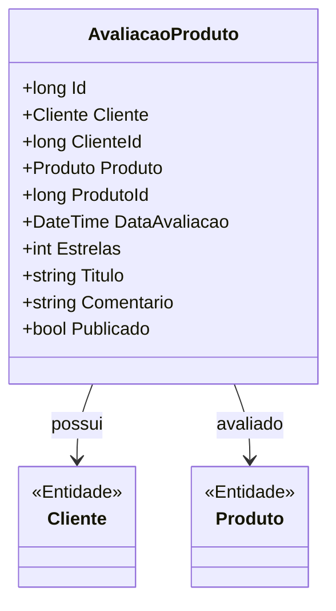

# AvaliacaoProduto
**Namespace**: IsthmusWinthor.Dominio.Entidades  
**Nome do Arquivo**: AvaliacaoProduto.cs  

## Visão Geral e Responsabilidade
A classe `AvaliacaoProduto` representa uma avaliação feita por um cliente sobre um produto específico. Ela serve para permitir que os clientes compartilhem suas opiniões sobre produtos, contribuindo para a transparência e ajudando outros usuários a tomar decisões informadas de compra. Essa entidade é essencial para o feedback de produtos e para a melhoria contínua dos serviços oferecidos pela empresa.

## Métodos de Negócio
*Nota: A classe AvaliacaoProduto não possui métodos com lógica de negócio significativa ou complexa além dos simples getters/setters.*

## Propriedades Calculadas e de Validação
- Não há propriedades calculadas ou de validação nesta classe.

## Navigations Property
- [Cliente](Cliente.md)
- [Produto](Produto.md)

## Tipos Auxiliares e Dependências
- Não utiliza Enumeradores ou Classes Estáticas/Helpers.

## Diagrama de Relacionamentos

---
Gerada em 29/12/2025 20:16:45
