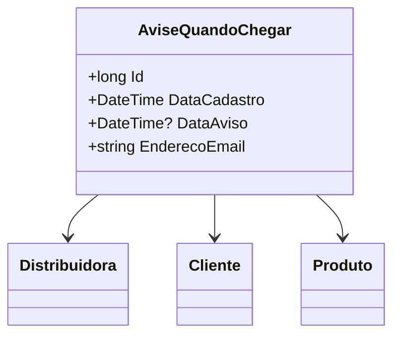

# AviseQuandoChegar
**Namespace**: IsthmusWinthor.Dominio.Entidades  
**Nome do Arquivo**: AviseQuandoChegar.cs  

## Visão Geral e Responsabilidade
A classe `AviseQuandoChegar` representa um mecanismo de notificação que permite que um cliente se inscreva para receber uma notificação por e-mail quando um produto estiver disponível por meio de uma distribuidora. Este modelo é crucial para o gerenciamento de expectativas de clientes e para aumentar a satisfação do consumidor ao saber que produtos com demanda alta ou esgotados estão disponíveis novamente.

## Métodos de Negócio
*Não há métodos com lógica complexa nesta classe que requerem documentação detalhada.*

## Propriedades Calculadas e de Validação
*Não há propriedades que possuam lógica no `get` ou validação no `set` que necessitem de documentação neste contexto.*

## Navigation Property
- [Distribuidora](Distribuidora.md)
- [Cliente](Cliente.md)
- [Produto](Produto.md)

## Tipos Auxiliares e Dependências
*Não há enumeradores ou classes estáticas/helpers usadas diretamente nesta classe que necessitem de documentação.*

## Diagrama de Relacionamentos

---
Gerada em 29/12/2025 20:16:52
