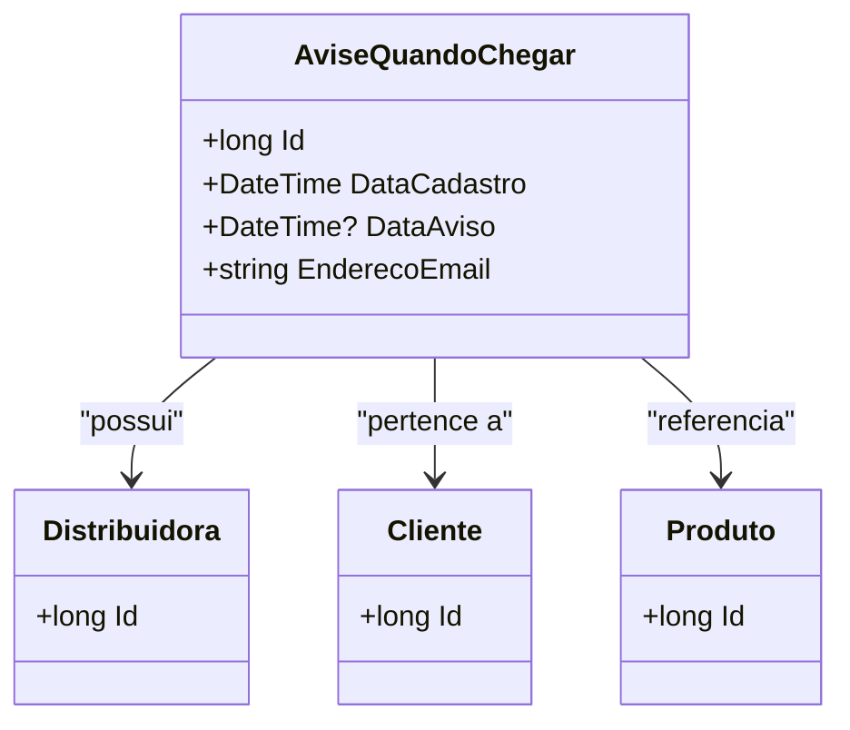

# AviseQuandoChegar
**Namespace**: IsthmusWinthor.Dominio.Entidades  
**Nome do Arquivo**: AviseQuandoChegar.cs

## Visão Geral e Responsabilidade
A classe `AviseQuandoChegar` representa uma entidade do domínio cuja responsabilidade é a notificação de clientes quando um produto se torna disponível. Essa funcionalidade atende uma demanda de negócio em que clientes manifestam interesse em produtos fora de estoque e desejam ser informados tão logo eles estejam disponíveis novamente. Assim, esta classe permite gerenciar eficientemente as notificações através de dados como distribuidora, cliente, e produto, além de acompanhar a data de cadastro e a data de aviso.

## Métodos de Negócio
Este modelo não possui métodos de negócios explícitos documentados, focando mais na estrutura de dados para a notificação.

## Propriedades Calculadas e de Validação
Esta classe não possui propriedades calculadas ou validações notáveis no getter ou setter de suas propriedades.

## Navigations Property
- **Distribuidora**: `[Distribuidora](Distribuidora.md)`
- **Cliente**: `[Cliente](Cliente.md)`
- **Produto**: `[Produto](Produto.md)`

## Tipos Auxiliares e Dependências
Esta classe não apresenta dependências evidentes a enumeradores (Enums) ou classes estáticas/helpers.

## Diagrama de Relacionamentos

