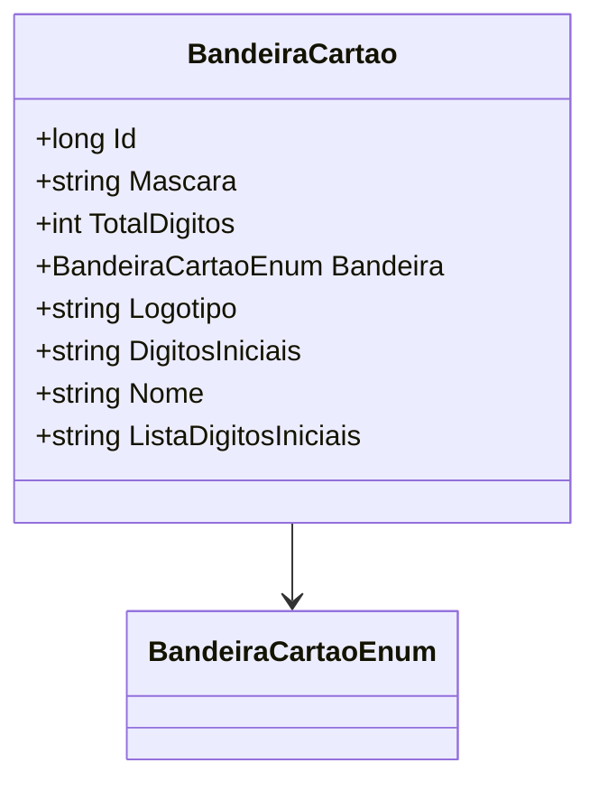

# BandeiraCartao

**Namespace**: IsthmusWinthor.Dominio.Entidades  
**Nome do Arquivo**: BandeiraCartao.cs

## Visão Geral e Responsabilidade
A classe `BandeiraCartao` representa as diversas bandeiras de cartões que podem ser utilizadas em transações financeiras. Sua principal responsabilidade é encapsular as informações relevantes sobre cada bandeira, como máscara, total de dígitos, logotipo e dígitos iniciais. Essa modelagem é crucial para garantir que as transações financeiras sejam corretamente configuradas e validadas conforme as regras específicas de cada bandeira de cartão.

## Propriedades Calculadas e de Validação
- **ListaDigitosIniciais**: Esta propriedade calcula a lista de dígitos iniciais com base na string `DigitosIniciais`. A lógica garantirá que, caso `DigitosIniciais` não esteja vazia, sua representação será retornada; caso contrário, retornará uma string vazia.

## Navigations Property
- Nenhuma propriedade complexa de domínio foi identificada nesta classe.

## Tipos Auxiliares e Dependências
- **Enumeradores**:
  - [BandeiraCartaoEnum](BandeiraCartaoEnum.md)

## Diagrama de Relacionamentos

---
Gerada em 29/12/2025 20:16:58
