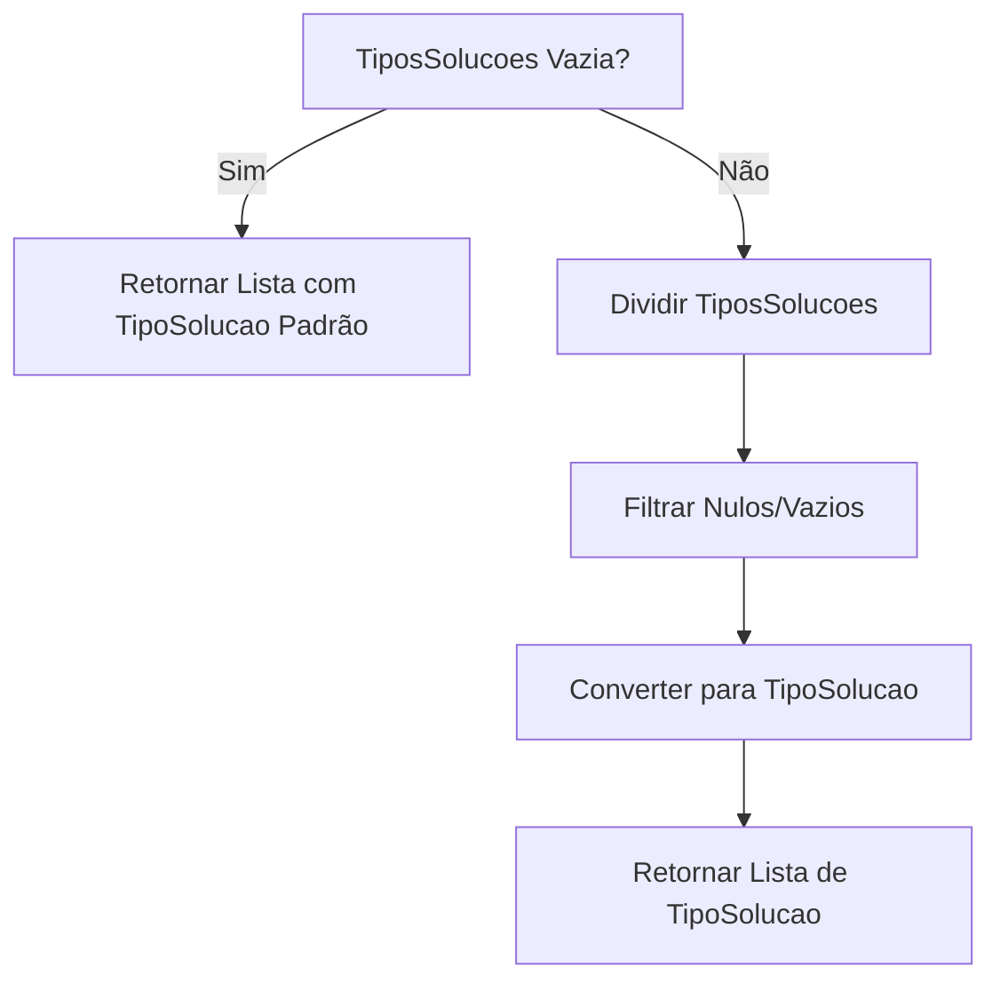
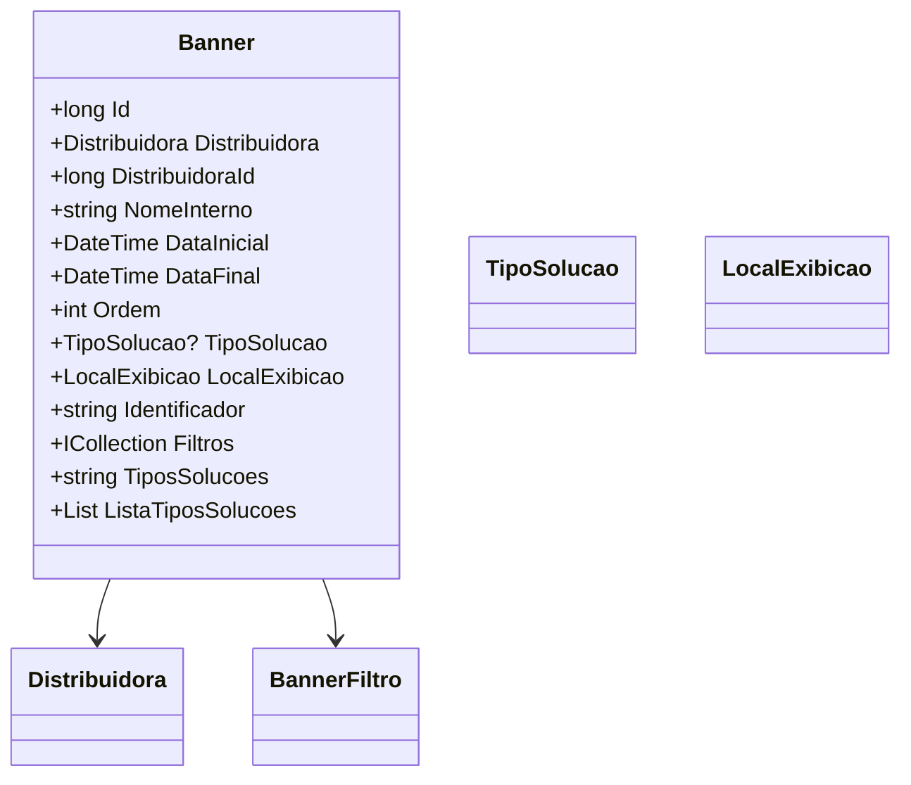

# Banner
**Namespace**: IsthmusWinthor.Dominio.Entidades  
**Nome do Arquivo**: Banner.cs  

## Visão Geral e Responsabilidade
A classe `Banner` representa um componente fundamental para a exibição de informações promocionais ou publicitárias dentro da plataforma. Ela está direcionada à gestão de banners vinculados a distribuidoras, permitindo especificar a vigência, filtragens e tipos de soluções associadas. O principal objetivo do `Banner` é garantir que as operações de exibição respeitem os critérios de data e tipo, alinhando-se às necessidades de marketing e visibilidade.

## Métodos de Negócio

### ListaTiposSolucoes: Visibilidade Pública
- **Objetivo**: Este método assegura que o sistema retorne uma lista válida de tipos de soluções correspondentes ao banner, considerando a string de entrada `TiposSolucoes`.
- **Comportamento**: 
    1. Verifica se a propriedade `TiposSolucoes` está vazia ou nula.
    2. Se estiver vazia, retorna uma lista contendo um único tipo de solução padrão.
    3. Caso contrário, divide a string `TiposSolucoes` em fragmentos, filtrando aqueles que não são nulos ou vazios.
    4. Para cada fragmento, tenta converter para um longo, e em seguida, para o tipo enumerado `TipoSolucao`.
    5. Retorna a lista de tipos de soluções válida.
- **Retorno**: Retorna uma lista de `TipoSolucao` que representa os tipos de soluções disponíveis para o banner.

## Propriedades Calculadas e de Validação
### ListaTiposSolucoes
- **Regra**: Esta propriedade calcula e retorna uma lista de tipos de soluções a partir da string `TiposSolucoes`, validando cada tipo antes de transformá-lo no enum correspondente.

## Navigations Property
- `[Distribuidora](Distribuidora.md)`
- `[BannerFiltro](BannerFiltro.md)`

## Tipos Auxiliares e Dependências
- `[TipoSolucao](TipoSolucao.md)`
- `[LocalExibicao](LocalExibicao.md)`

## Diagrama de Relacionamentos

