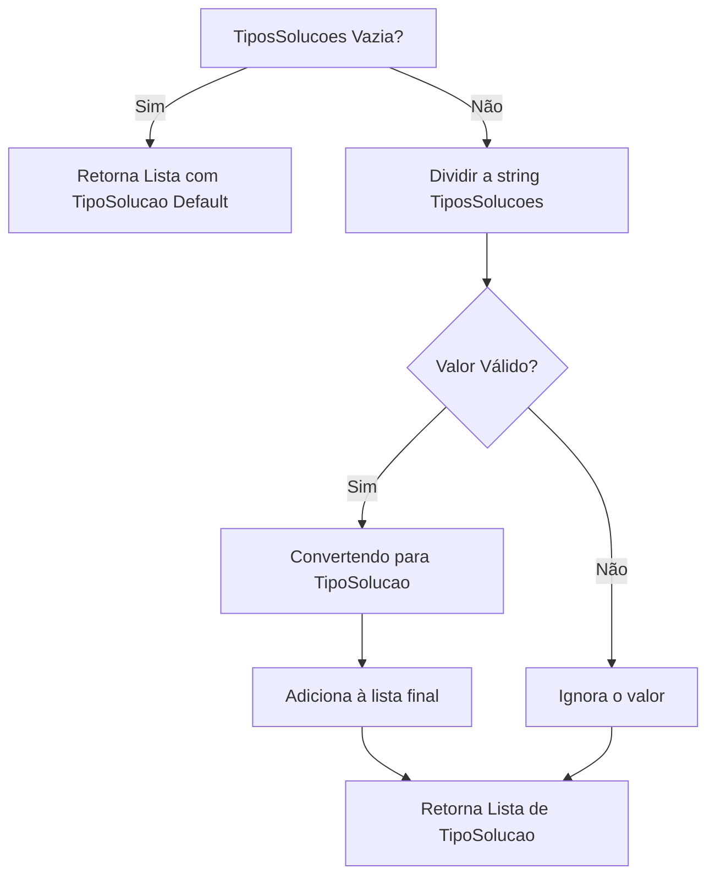
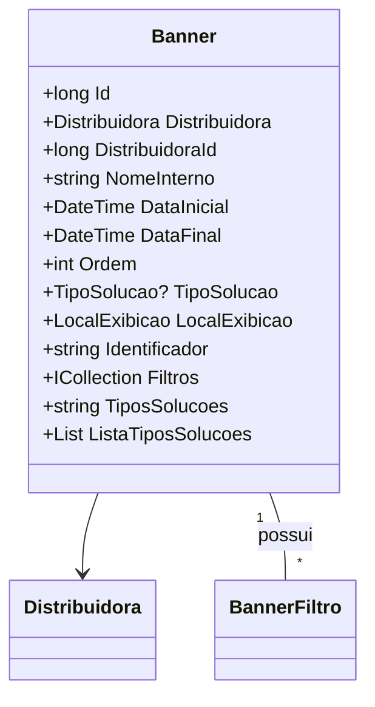

# Banner
**Namespace**: IsthmusWinthor.Dominio.Entidades  
**Nome do Arquivo**: Banner.cs  

## Visão Geral e Responsabilidade
A classe `Banner` representa uma entidade que gerencia a exibição de banners publicitários dentro de uma aplicação. Ela é responsável por armazenar informações cruciais sobre cada banner, incluindo a sua exibição em uma determinada distribuidora, o ciclo de vida do banner (data de início e fim) e os tipos de soluções associadas. O problema de negócio que esta classe resolve envolve a organização e exibição eficaz de banners em plataformas digitais, garantindo que apenas os banners válidos e apropriados sejam apresentados ao público-alvo.

## Métodos de Negócio

### ListaTiposSolucoes: `public List<TipoSolucao> ListaTiposSolucoes`
- **Objetivo**: Este método garante que os tipos de solução associados ao banner sejam convertidos e apresentados de forma útil para o sistema, facilitando a identificação de quais soluções estão atualmente vinculadas ao banner.
- **Comportamento**: 
  1. Verifica se a propriedade `TiposSolucoes` está vazia.
  2. Se estiver vazia, cria uma lista contendo o valor padrão de `TipoSolucao`.
  3. Caso contrário, tenta dividir a string `TiposSolucoes` em uma lista de valores.
  4. Para cada valor na string, verifica se pode ser convertido em um número válido.
  5. Os números válidos são convertidos em um enumerador `TipoSolucao` e adicionados à lista final.
- **Retorno**: Retorna uma lista de `TipoSolucao` que representa as soluções ativas associadas ao banner.

## Propriedades Calculadas e de Validação

### ListaTiposSolucoes
- **Regra**: A propriedade `ListaTiposSolucoes` realiza um cálculo para gerar uma lista de `TipoSolucao` a partir da string `TiposSolucoes`. Se a string estiver vazia, retorna um tipo padrão. Caso ocorra uma falha na conversão, retornará uma lista vazia.

## Navigations Property
- [Distribuidora](Distribuidora.md) - Representa a distribuidora que está associada a este banner.
- [BannerFiltro](BannerFiltro.md) - Coleção de filtros aplicados ao banner.

## Tipos Auxiliares e Dependências
- [TipoSolucao](TipoSolucao.md) - Enumerador que define os tipos de solução disponíveis para o banner.
- [LocalExibicao](LocalExibicao.md) - Enum que representa as localizações onde o banner pode ser exibido.

## Diagrama de Relacionamentos

---
Gerada em 29/12/2025 20:17:14
