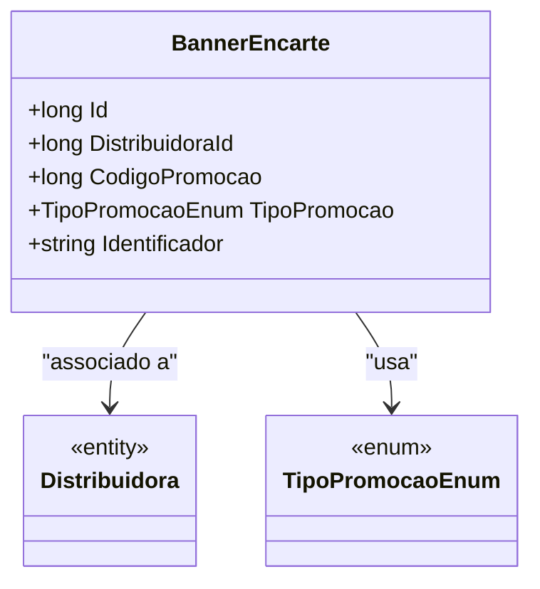

# BannerEncarte
**Namespace**: IsthmusWinthor.Dominio.Entidades  
**Nome do Arquivo**: BannerEncarte.cs  

## Visão Geral e Responsabilidade
A classe `BannerEncarte` representa um componente do sistema relacionado à promoção de produtos ou serviços através de banners distribuídos por diversas distribuidoras. Ela é responsável por armazenar e processar informações relevantes para a criação, identificação e controle das promoções ativas, assegurando que os dados referentes a cada campanha promocional estejam integrados com as entidades de distribuição.

## Métodos de Negócio
Esta classe não possui métodos de negócio com lógica complexa; todos os métodos implementados são simples getters e setters.

## Propriedades Calculadas e de Validação
Esta classe não possui propriedades que implementem lógica de validação ou cálculos em seus getters ou setters.

## Navigation Property
- [`Distribuidora`](Distribuidora.md): Representa a distribuidora associada ao banner encarregado.

## Tipos Auxiliares e Dependências
- [`TipoPromocaoEnum`](TipoPromocaoEnum.md): Enum responsável por definir os tipos de promoção disponíveis, categorizando as diferentes ofertas que podem ser aplicadas.

## Diagrama de Relacionamentos

