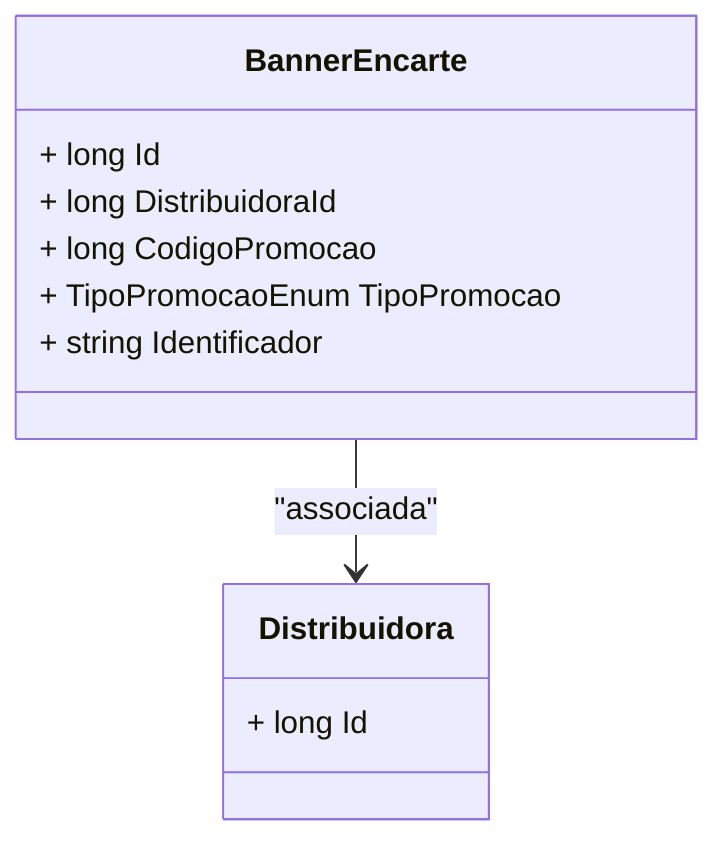

# BannerEncarte
**Namespace**: IsthmusWinthor.Dominio.Entidades  
**Nome do Arquivo**: BannerEncarte.cs  

## Visão Geral e Responsabilidade
A classe `BannerEncarte` representa uma entidade no domínio que modela um banner publicitário associado a uma distribuidora. Seu papel fundamental é registrar informações sobre banners promocionais que são utilizados em campanhas de marketing, incluindo detalhes sobre a distribuidora, o código de promoção e o tipo de promoção associado. Essa classe ajuda a garantir a integridade e consistência dos dados promocionais dentro do sistema.

## Métodos de Negócio
_Não há métodos com lógica complexa definidos nesta classe._

## Propriedades Calculadas e de Validação
- Neste caso, não há propriedades que realizem cálculos ou validações complexas.

## Navigation Property
- [Distribuidora](Distribuidora.md): Representa a distribuidora associada ao banner, permitindo a navegação para informações adicionais sobre a entidade distribuidora.

## Tipos Auxiliares e Dependências
- [TipoPromocaoEnum](TipoPromocaoEnum.md): Enumeração que define os diferentes tipos de promoção que podem estar associados ao `BannerEncarte`.

## Diagrama de Relacionamentos

Esta documentação tem a finalidade de elucidar as regras de negócio e integridade de dados que a classe `BannerEncarte` estabelece dentro do contexto do sistema, assegurando uma comunicação clara e precisa sobre seu funcionamento.
---
Gerada em 29/12/2025 20:17:22
