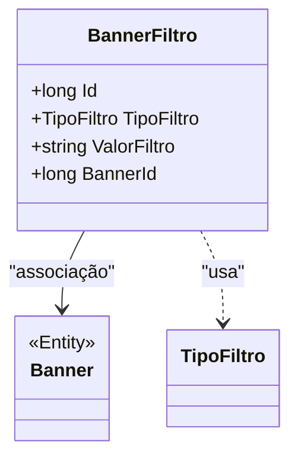

# BannerFiltro

**Namespace**: IsthmusWinthor.Dominio.Entidades  
**Nome do Arquivo**: BannerFiltro.cs  

## Visão Geral e Responsabilidade
A classe `BannerFiltro` representa um filtro associado a um banner dentro do sistema. O principal objetivo dessa classe é permitir a classificação e segmentação dos banners com base em diferentes critérios de filtro (definidos pelo tipo de filtro) e valores relacionados, ajudando a direcionar conteúdos para públicos específicos. Essa estrutura minimiza a redundância de dados e aprimora a personalização das informações apresentadas aos usuários.

## Métodos de Negócio
_Nenhum método com lógica relevante encontrado nesta classe. Portanto, não há métodos de negócio a serem documentados._

## Propriedades Calculadas e de Validação
_Nenhuma propriedade com lógica de cálculo ou validação foi identificada nesta classe._

## Navigation Property
- [Banner](Banner.md): Representa o objeto `Banner` do qual este `BannerFiltro` está associado, permitindo a navegação entre um filtro e seu banner correspondente.

## Tipos Auxiliares e Dependências
- [TipoFiltro](TipoFiltro.md): Enumerador que define os tipos de filtros que podem ser aplicados a um banner.

## Diagrama de Relacionamentos

---
Gerada em 29/12/2025 20:17:29
