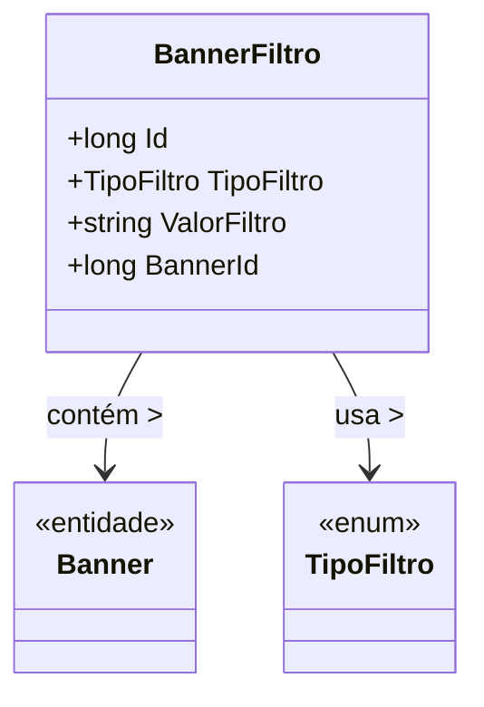

# BannerFiltro
- **Namespace**: IsthmusWinthor.Dominio.Entidades
- **Nome do Arquivo**: BannerFiltro.cs

## Visão Geral e Responsabilidade
A classe `BannerFiltro` representa um filtro associado a um banner em um sistema de gestão de anúncios ou promoções. Seu objetivo é permitir que a aplicação gerencie condições específicas sob as quais um banner deve ser exibido ou ocultado, de acordo com critérios definidos pelo usuário, como tipo de filtro e valor do filtro. Isso fornece flexibilidade na apresentação de informações aos usuários, garantindo que os banners são exibidos de maneira relevante.

## Métodos de Negócio
### Título: `...` (sem métodos de negócio complexos identificáveis)
- **Objetivo**: A classe não possui métodos de negócio com lógica significativa. 
- **Comportamento**: Apenas contém propriedades e não efetua validação ou lógica interna que modifique seu estado de uma forma que impacte as regras de negócios.
- **Retorno**: N/A

## Propriedades Calculadas e de Validação
- N/A

## Navigation Property
- `[Banner](Banner.md)`: Representa a classe associada que contém as informações do banner, estabelecendo uma relação com o filtro de maneira que o banner possa ser acessado a partir deste filtro.

## Tipos Auxiliares e Dependências
- `[TipoFiltro](TipoFiltro.md)`: Enum que especifica os diferentes tipos de filtros aplicáveis a um banner.

## Diagrama de Relacionamentos

