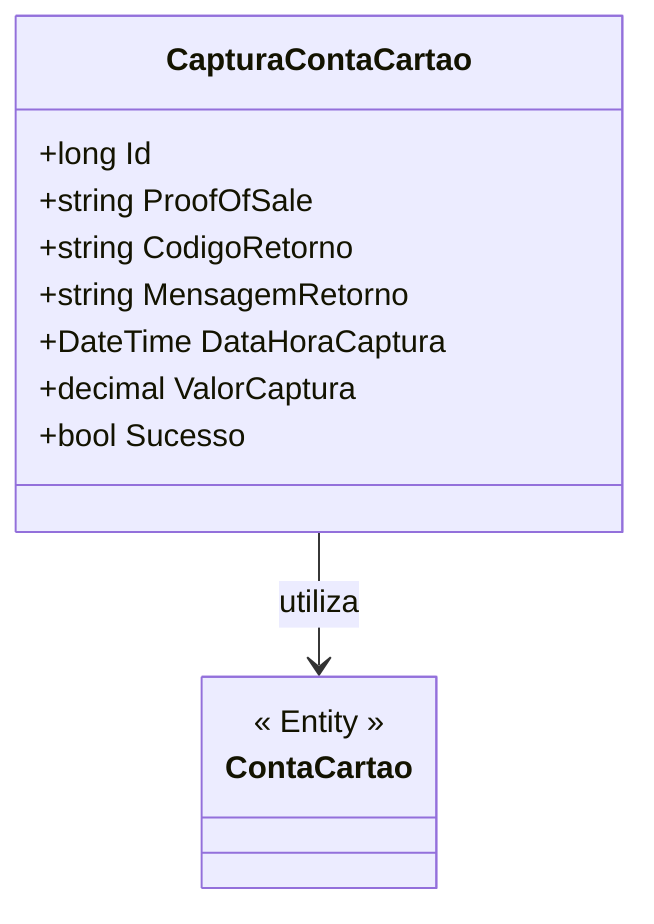

# CapturaContaCartao
- **Namespace**: IsthmusWinthor.Dominio.Entidades
- **Nome do Arquivo**: CapturaContaCartao.cs

## Visão Geral e Responsabilidade
A classe `CapturaContaCartao` representa a entidade responsável por registrar informações relacionadas à captura de pagamentos realizados através de cartões. Este modelo de domínio é crucial para o acompanhamento e gestão das transações, garantindo que todos os detalhes relevantes, como IDs de conta, valores capturados e status da captura, sejam persistidos de forma consistente. Através desta classe, o sistema resolve o problema de rastreamento e verificação de transações financeiras, assegurando a integridade e a confiabilidade das operações de captura.

## Métodos de Negócio
(Observação: A classe fornecida não contém métodos com lógica de negócio complexa que se enquadrem nas especificações. Apenas propriedades simples são consideradas.)

## Propriedades Calculadas e de Validação
- **ValorCaptura**: A propriedade `ValorCaptura` é uma representação do valor total que foi capturado na transação. Esta propriedade deve ser validada para garantir que o valor não seja negativo, representando efetivamente a captura financeira. 

## Navigations Property
- [ContaCartao](ContaCartao.md): Esta propriedade representa a entidade do cartão de crédito associada à captura registrada.

## Tipos Auxiliares e Dependências
(No código fornecido, não foram identificados tipos auxiliares, enums ou classes estáticas/helpers utilizados nesta classe.)

## Diagrama de Relacionamentos

Esta documentação fornece uma visão clara do modelo de domínio `CapturaContaCartao`, enfatizando suas responsabilidades no contexto do sistema, além de garantir que as regras de negócio que sustentam a integridade dos dados sejam compreendidas e mantidas ao longo do ciclo de vida da aplicação.
