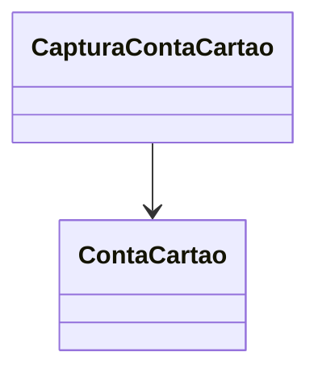

# CapturaContaCartao
**Namespace**: IsthmusWinthor.Dominio.Entidades  
**Nome do Arquivo**: CapturaContaCartao.cs  

## Visão Geral e Responsabilidade
A classe `CapturaContaCartao` representa uma captura de pagamento realizada com um cartão de crédito ou débito. Ela encapsula todas as informações necessárias sobre uma transação de pagamento, incluindo dados de autorização, valor da captura e status de sucesso. O problema de negócio que essa classe resolve é a necessidade de registrar e acompanhar transações financeiras permitindo que sistemas de gestão processem e verifiquem a integridade dessas transações.

## Métodos de Negócio
Atualmente, a classe `CapturaContaCartao` não possui métodos de negócio complexos. Todos os métodos são simples getters e setters para as propriedades. No entanto, a lógica de validação será discutida nas propriedades calculadas e de validação.

## Propriedades Calculadas e de Validação
- `ValorCaptura`
  - **Regra**: O valor deve ser um número positivo, representando a quantia capturada na transação. Este valor é vital para garantir que a transação financeira não seja incorreta.

- `Sucesso`
  - **Regra**: Esta propriedade indica se a captura foi bem-sucedida ou não, com base nas informações de retorno (`CodigoRetorno` e `MensagemRetorno`). Se a captura falhar, deve-se tomar ações corretivas, e a propriedade `Sucesso` deve ser atualizada para `false`.

## Navigations Property
- [ContaCartao](ContaCartao.md)

## Tipos Auxiliares e Dependências
- Não há enumeradores ou classes auxiliares utilizadas.

## Diagrama de Relacionamentos

---
Gerada em 29/12/2025 20:17:36
