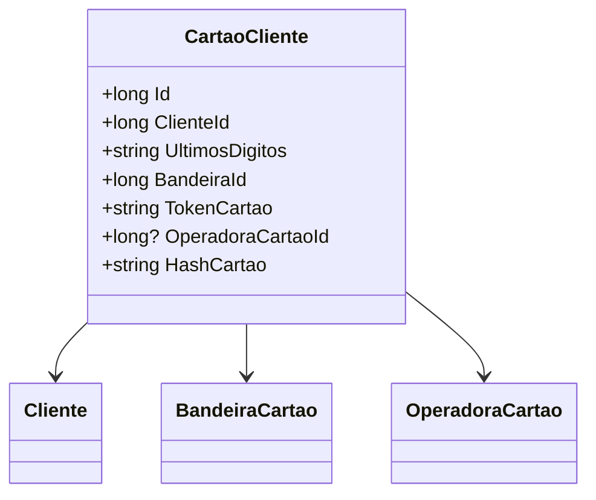

# CartaoCliente

**Namespace**: IsthmusWinthor.Dominio.Entidades  
**Nome do Arquivo**: CartaoCliente.cs  

## Visão Geral e Responsabilidade
A classe `CartaoCliente` representa um modelo de domínio que gerencia informações relacionadas ao cartão de crédito ou débito associado a um cliente. Seu papel é garantir que os dados do cartão sejam armazenados de forma segura e que a duplicidade de informações seja evitada através da utilização de um hash exclusivo. Essa classe aborda o problema de como tratar informações sensíveis de pagamento, mantendo a integridade e segurança dos dados.

## Métodos de Negócio
Nenhum método com lógica de negócio complexa foi identificado nesta classe.

## Propriedades Calculadas e de Validação
- `HashCartao`: 
  - Regra: O `HashCartao` é gerado a partir do número do cartão e da bandeira do cartão (sem máscara), para garantir que não existam entradas duplicadas no sistema, uma vez que o token gerado varia a cada transação.

## Navigations Property
- `Cliente`: [Cliente](Cliente.md)  
- `Bandeira`: [BandeiraCartao](BandeiraCartao.md)  
- `OperadoraCartao`: [OperadoraCartao](OperadoraCartao.md)  

## Tipos Auxiliares e Dependências
- **Enums**: [BandeiraCartao](BandeiraCartao.md)
  
## Diagrama de Relacionamentos

---
Gerada em 29/12/2025 20:17:47
