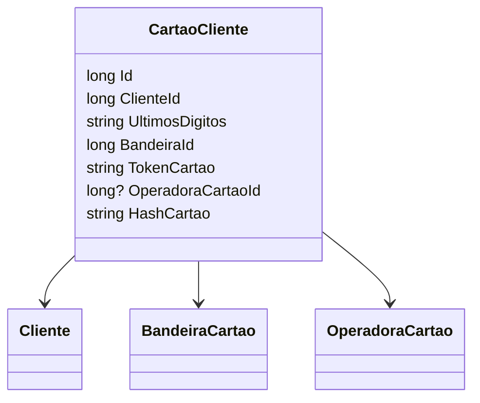

# CartaoCliente
**Namespace**: IsthmusWinthor.Dominio.Entidades  
**Nome do Arquivo**: CartaoCliente.cs  

## Visão Geral e Responsabilidade
A classe `CartaoCliente` representa o cartão de crédito de um cliente no sistema, atuando como uma entidade fundamental para a gestão de cartões de clientes. O principal objetivo é garantir que os dados dos cartões sejam armazenados de maneira segura e organizada, evitando duplicidade e mantendo uma associação clara entre clientes e seus cartões.

## Métodos de Negócio
Esta classe não contém métodos com lógica complexa além dos getters e setters normais. A lógica é gerida apenas na persistência de dados.

## Propriedades Calculadas e de Validação
- **HashCartao**:
  - Objetivo: Esta propriedade gera um identificador único para o cartão de crédito, baseado no número do cartão sem máscara e na bandeira. Isso evita a duplicidade no banco de dados, uma vez que o token é único a cada geração, e a informação completa do cartão não é armazenada.

## Navigation Property
- **Cliente**: `[Cliente](Cliente.md)`
- **Bandeira**: `[BandeiraCartao](BandeiraCartao.md)`
- **OperadoraCartao**: `[OperadoraCartao](OperadoraCartao.md)` (DEPRECATED)

## Tipos Auxiliares e Dependências
- **Enums**:
  - Nenhum tipo enumerador é utilizado diretamente nesta classe.
  
- **Classes Estáticas/Helpers**:
  - Nenhuma classe auxiliar é referenciada.

## Diagrama de Relacionamentos

Esta documentação apresenta a estrutura e regras de negócio da classe `CartaoCliente`, evidenciando seu papel na integridade dos dados de cartões de clientes e sua relação com outras entidades no sistema.
