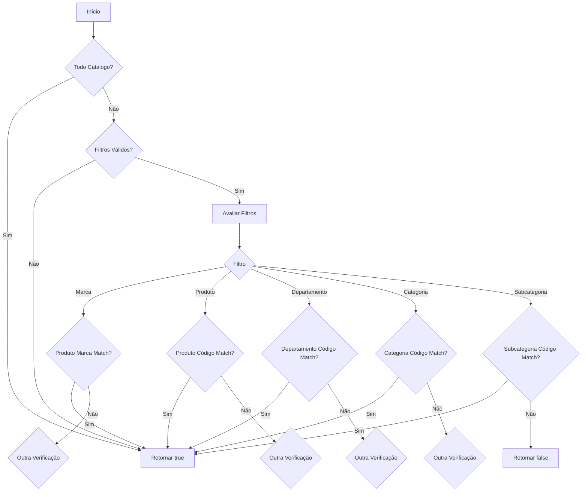
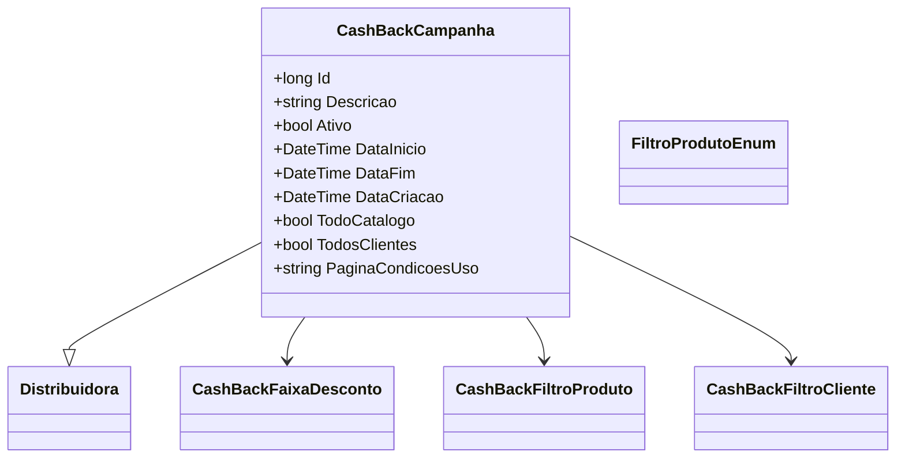

# CashBackCampanha
**Namespace**: IsthmusWinthor.Dominio.Entidades  
**Nome do Arquivo**: CashBackCampanha.cs  

## Visão Geral e Responsabilidade
A classe `CashBackCampanha` representa uma campanha de cashback, que é uma estratégia de marketing utilizada por empresas para promover produtos ou serviços. O objetivo principal desta classe é gerenciar as condições sob as quais um cliente pode receber um retorno financeiro (cashback) ao adquirir um produto. A classe lida com informações como a distribuidora associada, datas de validade da campanha e quais produtos ou clientes estão elegíveis para o cashback.

## Métodos de Negócio

### Título: SeAplica (public)
**Objetivo**: Garante que a campanha de cashback é aplicada corretamente a um determinado produto com base em critérios específicos.  
**Comportamento**: 
1. Verifica se a campanha se aplica a todo o catálogo ou se não há filtros.
2. Agrupa os filtros de produtos da campanha.
3. Para cada grupo de filtros, realiza verificação contra o produto fornecido, avaliando as propriedades relevantes (marca, código, departamento, categoria, subcategoria).
4. Retorna `true` se um dos filtros aplicáveis for satisfeito; caso contrário, retorna `false`.

**Retorno**: Retorna um valor booleano que indica se a campanha de cashback se aplica ao produto.

## Propriedades Calculadas e de Validação

### MarcasExclusivasParaUsoList
- **Regra**: Retorna uma lista de IDs (`long`) das marcas exclusivas para uso, extraídas de uma string delimitada por caracteres especiais. Caso a string esteja vazia ou o parsing falhe, retorna uma lista vazia.

### MaiorDesconto
- **Regra**: Retorna a faixa de desconto mais alta aplicada à campanha. A lógica faz uso da ordenação das faixas de desconto em ordem decrescente e retorna o primeiro elemento da lista.

## Navigations Property
- [Distribuidora](Distribuidora.md)
- [CashBackFaixaDesconto](CashBackFaixaDesconto.md)
- [CashBackFiltroProduto](CashBackFiltroProduto.md)
- [CashBackFiltroCliente](CashBackFiltroCliente.md)

## Tipos Auxiliares e Dependências
- [FiltroProdutoEnum](FiltroProdutoEnum.md)

## Diagrama de Relacionamentos

