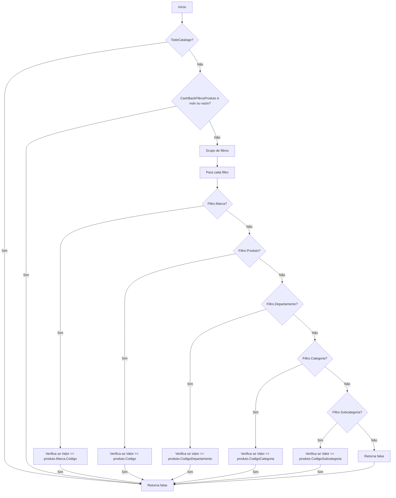
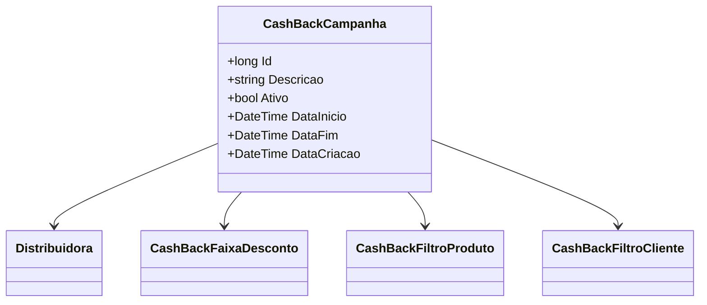

# CashBackCampanha
- **Namespace**: IsthmusWinthor.Dominio.Entidades
- **Nome do Arquivo**: CashBackCampanha.cs

## Visão Geral e Responsabilidade
A classe `CashBackCampanha` representa uma campanha de cashback que pode ser aplicada a produtos vendidos por uma distribuidora. Ela permite a configuração de condições diversas, como a duração da campanha, a inclusão de marcas específicas e a aplicação a todo catálogo ou a clientes específicos. O seu objetivo é facilitar a gestão e aplicação de campanhas de descontos, que incentivam a compra de determinados produtos.

## Métodos de Negócio

### Título: SeAplica (public)
- **Objetivo**: Verificar se a campanha de cashback se aplica a um determinado produto com base em filtros configurados.
- **Comportamento**: 
  1. Inicialmente, verifica se a campanha se aplica a todo o catálogo (`TodoCatalogo`).
  2. Se não se aplica a todo o catálogo, valida os filtros de produtos disponíveis (`CashBackFiltrosProduto`).
  3. Agrupa os filtros por tipo (marca, produto, departamento, categoria e subcategoria).
  4. Para cada grupo de filtros, verifica se o valor do produto corresponde a algum dos filtros aplicáveis.
  5. Retorna `true` se pelo menos um filtro corresponde; retorna `false` caso contrário.
  

## Propriedades Calculadas e de Validação

### MaiorDesconto
- **Descrição**: Retorna o objeto `CashBackFaixaDesconto` que possui o maior desconto da lista de faixas de desconto da campanha.
- **Regra**: A lógica busca a faixa de desconto com o maior valor e o retorna. Se não houver nenhuma faixa de desconto, o retorno será `null`.

### MarcasExclusivasParaUsoList
- **Descrição**: Lista as marcas exclusivas para uso a partir de uma string formatada, substituindo caracteres separadores e convertendo cada entrada em um identificador longo.
- **Regra**: A lógica garante que mesmo que haja formatação inconsistente, a lista resultante será limpa e livre de erros.

## Navigations Property
- [Distribuidora](Distribuidora.md)
- [CashBackFaixaDesconto](CashBackFaixaDesconto.md)
- [CashBackFiltroProduto](CashBackFiltroProduto.md)
- [CashBackFiltroCliente](CashBackFiltroCliente.md)

## Tipos Auxiliares e Dependências
- [FiltroProdutoEnum](FiltroProdutoEnum.md) - Enum utilizado para categorizar os diferentes tipos de filtro aplicáveis à campanha.

## Diagrama de Relacionamentos

---
Gerada em 29/12/2025 20:18:05
