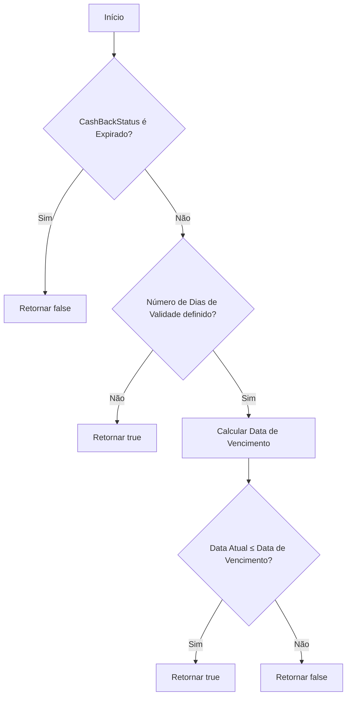
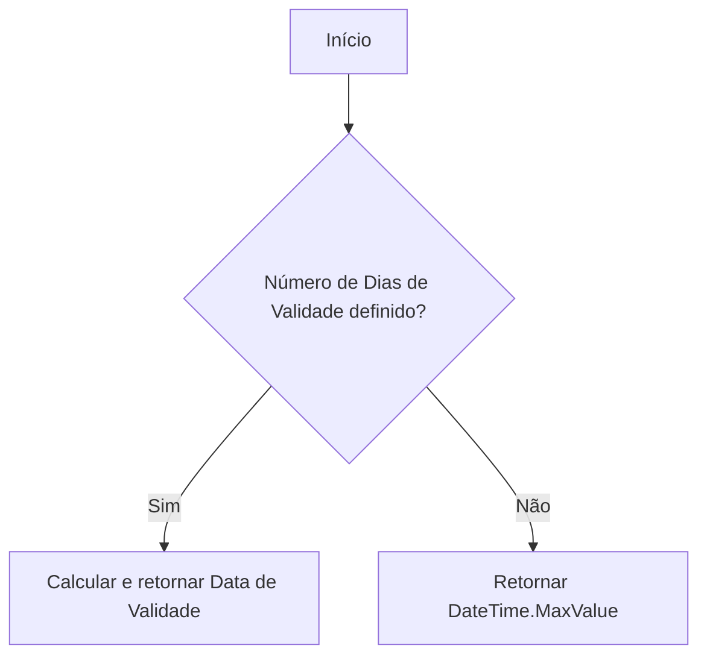
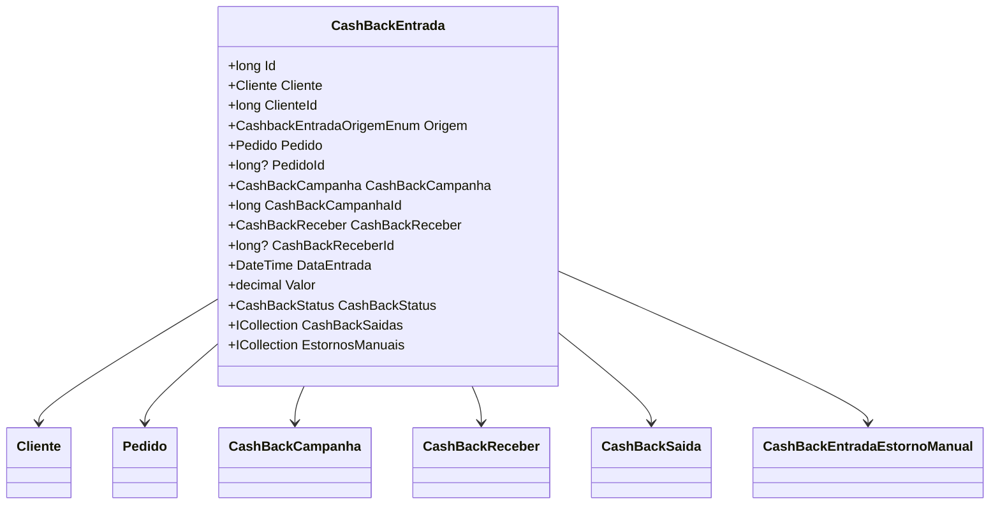

# CashBackEntrada
**Namespace**: IsthmusWinthor.Dominio.Entidades  
**Nome do Arquivo**: CashBackEntrada.cs  

## Visão Geral e Responsabilidade
A classe `CashBackEntrada` representa uma entrada de cashback vinculada a um cliente e a um pedido. Ela gerencia informações como a origem do cashback, sua validade, e se existem operações de estornos manuais associadas. A principal responsabilidade da classe é garantir que as regras de negócio relacionadas a cashback sejam respeitadas, como a validação do estado do cashback e a aplicação de regras referentes a estornos manuais.

## Métodos de Negócio

### Método: PodeSerUsado()
**Visibilidade**: Public  
**Objetivo**: Este método verifica se o cashback pode ser utilizado com base no seu estado e validade.  
**Comportamento**: 
1. Verifica se o `CashBackStatus` é `Expirado`. Se for, retorna `false`.
2. Se não houver um número de dias de validade definido, retorna `true`.
3. Calcula a data de vencimento, adicionando o número de dias de validade à `DataEntrada`.
4. Compara a data atual com a data de vencimento para determinar se o cashback ainda é utilizável.
  
**Retorno**: Retorna `true` se o cashback pode ser utilizado e `false` caso contrário.

### Método: Validade()
**Visibilidade**: Public  
**Objetivo**: Retornar a data de validade do cashback.  
**Comportamento**: 
1. Verifica se o `NumeroDiasValidade` é definido.
2. Se não for, retorna `DateTime.MaxValue`, indicando que não há limite de validade.
3. Caso contrário, adiciona o número de dias de validade à `DataEntrada` e retorna a data resultante.

**Retorno**: Retorna a data de validade do cashback ou `DateTime.MaxValue` caso não haja um prazo de validade definido.

## Propriedades Calculadas e de Validação

### PossuiDebitoManual
- **Regra**: Indica se há algum estorno manual do tipo débito associado. Retorna `true` se existem estornos onde a operação não é de crédito.

### PossuiCreditoManual
- **Regra**: Verifica se existem créditos manuais vinculados a este cashback e se a origem é `Manual`.

### PossuiEstornosManuais
- **Regra**: Determina se existe qualquer tipo de estorno manual associado, seja crédito ou débito.

### DescricaoOperacaoEstornoManual
- **Regra**: Retorna uma descrição da operação de estorno manual. Se não houver estornos, retorna uma string vazia; se houver um crédito, retorna "Lançamento Crédito", caso contrário, "Lançamento Débito".

## Navigations Property
- [Cliente](Cliente.md)
- [Pedido](Pedido.md)
- [CashBackCampanha](CashBackCampanha.md)
- [CashBackReceber](CashBackReceber.md)
- [CashBackSaida](CashBackSaida.md)
- [CashBackEntradaEstornoManual](CashBackEntradaEstornoManual.md)

## Tipos Auxiliares e Dependências
- [CashbackEntradaOrigemEnum](CashbackEntradaOrigemEnum.md)
- [CashBackStatus](CashBackStatus.md)
- [DateTimeUtil](DateTimeUtil.md)

## Diagrama de Relacionamentos

---
Gerada em 29/12/2025 20:18:24
