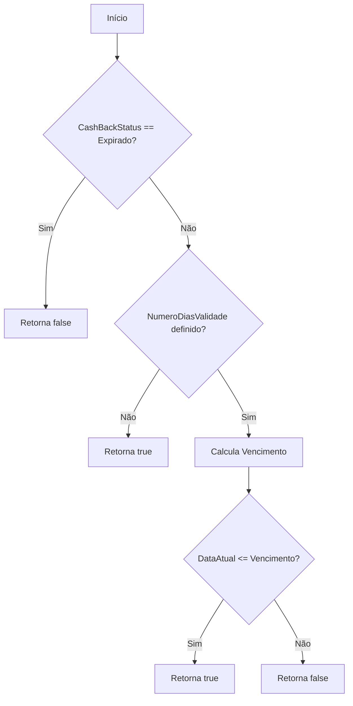
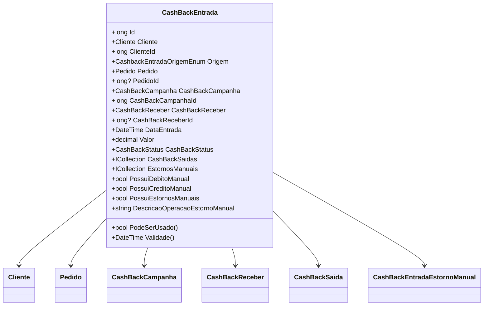

# CashBackEntrada
**Namespace**: IsthmusWinthor.Dominio.Entidades  
**Nome do Arquivo**: CashBackEntrada.cs

## Visão Geral e Responsabilidade
A classe `CashBackEntrada` representa uma entrada de cashback em um sistema de gestão financeiro. Ela é responsável por gerenciar dados relacionados a campanhas de cashback, incluindo a origem dessa entrada, a data e o valor associado, além de controlar o estado do cashback e possíveis estornos. A classe tem como objetivo garantir a integridade dos dados relacionados a entradas de cashback e assegurar que as operações de cashback sejam válidas de acordo com regras específicas.

## Métodos de Negócio

### PodeSerUsado - Público
**Objetivo:** Garante que o cashback pode ser utilizado com base em regras específicas de status e validade.  
**Comportamento:**
1. Verifica se o status do cashback é "Expirado". Se for, retorna `false`.
2. Verifica se a campanha de cashback tem um número de dias de validade definido.
   - Se não tiver, retorna `true`, permitindo o uso.
3. Calcula a data de vencimento adicionando o número de dias de validade à data de entrada do cashback.
4. Compara a data atual com a data de vencimento.
   - Se a data atual for menor ou igual à data de vencimento, retorna `true`, caso contrário, retorna `false`.  
**Retorno:** `true` se o cashback pode ser utilizado; `false` caso contrário.  

### Validade - Público
**Objetivo:** Calcula a data de validade do cashback com base em sua data de entrada e política de validade.  
**Comportamento:**
1. Tenta obter o número de dias de validade da campanha de cashback.
2. Se não houver um número de dias definido, retorna `DateTime.MaxValue`, indicando que o cashback não expira.
3. Se houver, soma o número de dias de validade à data de entrada e retorna a data resultante.
4. Em caso de exceção, também retorna `DateTime.MaxValue`.  
**Retorno:** Data de validade do cashback, ou `DateTime.MaxValue` se não houver validade definida.  

## Propriedades Calculadas e de Validação

- **PossuiDebitoManual**: Indica se existem estornos manuais do tipo "Débito". Regra: Verifica se a coleção de estornos não é `null` e se há ao menos um estorno com operação diferente de "Crédito".
  
- **PossuiCreditoManual**: Indica se existem estornos manuais do tipo "Crédito" realizadas de forma manual. Regra: Verifica se a coleção de estornos não é `null`, se há ao menos um estorno do tipo "Crédito" e se a origem do cashback é "Manual".

- **PossuiEstornosManuais**: Indica se há estornos manuais, sejam eles de débito ou crédito. Regra: Utiliza as propriedades `PossuiCreditoManual` e `PossuiDebitoManual`.

- **DescricaoOperacaoEstornoManual**: Retorna uma descrição da operação de estorno manual. Regra: Se não houver estornos manuais, retorna uma string vazia; se houver estornos do tipo "Crédito", retorna "Lançamento Crédito", caso contrário retorna "Lançamento Débito".

## Navigations Property
- [Cliente](Cliente.md)
- [Pedido](Pedido.md)
- [CashBackCampanha](CashBackCampanha.md)
- [CashBackReceber](CashBackReceber.md)
- [CashBackSaida](CashBackSaida.md)
- [CashBackEntradaEstornoManual](CashBackEntradaEstornoManual.md)

## Tipos Auxiliares e Dependências
- [CashbackEntradaOrigemEnum](CashbackEntradaOrigemEnum.md)
- [CashBackStatus](CashBackStatus.md)
- [CashBackEntradaEstornoManualEnum](CashBackEntradaEstornoManualEnum.md)
- [DateTimeUtil](DateTimeUtil.md)

## Diagrama de Relacionamentos

