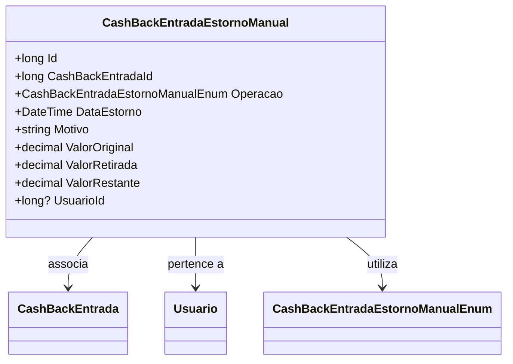

# CashBackEntradaEstornoManual
**Namespace**: IsthmusWinthor.Dominio.Entidades  
**Nome do Arquivo**: CashBackEntradaEstornoManual.cs

## Visão Geral e Responsabilidade
A classe `CashBackEntradaEstornoManual` representa uma operação de estorno manual de um cashback. Sua principal responsabilidade é registrar os detalhes de um estorno, incluindo informações sobre o valor inicial do cashback, o valor retirado, o restante a ser recuperado, a data do estorno e o motivo. Esse registro é crucial para garantir a transparência e a rastreabilidade das operações financeiras relacionadas a cashback dentro do sistema.

## Métodos de Negócio
*Nota: A classe não possui métodos que implementem lógica de negócio complexa. Somente propriedades e campos são apresentados, com ênfase nas regras e na integridade de dados.*

## Propriedades Calculadas e de Validação
- **ValorRestante**: 
  - **Regra**: A propriedade `ValorRestante` deve ser calculada como a diferença entre `ValorOriginal` e `ValorRetirada`. Este cálculo é fundamental para garantir que não se exceda o montante disponível para estorno.

## Navigation Properties
- [CashBackEntrada](CashBackEntrada.md): Representa a entrada de cashback associada ao estorno manual.
- [Usuario](Usuario.md): O usuário que realizou o estorno.

## Tipos Auxiliares e Dependências
- [CashBackEntradaEstornoManualEnum](CashBackEntradaEstornoManualEnum.md): Enum usado para identificar o tipo de operação de estorno.

## Diagrama de Relacionamentos

---
Gerada em 29/12/2025 20:18:45
