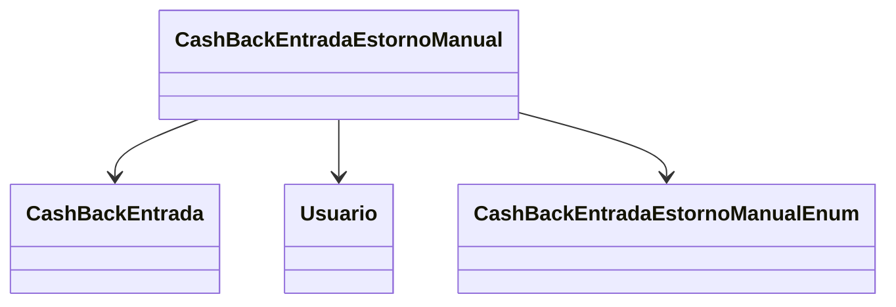

# CashBackEntradaEstornoManual
- **Namespace**: IsthmusWinthor.Dominio.Entidades
- **Nome do Arquivo**: CashBackEntradaEstornoManual.cs

## Visão Geral e Responsabilidade
A classe `CashBackEntradaEstornoManual` atua como uma representação dos estornos manuais realizados em entradas de cashback dentro do sistema. O seu principal objetivo é registrar as informações relacionadas a um estorno, incluindo valores originais, retiradas, o motivo do estorno e a data em que ele ocorreu. Esta classe é fundamental para a integridade dos dados financeiros, garantindo que cada estorno seja devidamente documentado e associado à entrada de cashback correspondente.

## Métodos de Negócio
A classe não contém métodos de negócio significativos que implementem lógica de negócio complexa. Ela se concentra mais em representar os dados necessários para os estornos.

## Propriedades Calculadas e de Validação
- **ValorRestante**: Esta propriedade deve representar a quantia que ainda está disponível após a retirada. Este cálculo é derivado da diferença entre o `ValorOriginal` e o `ValorRetirada`.
    - Regra: `ValorRestante = ValorOriginal - ValorRetirada`.

## Navigations Property
- `[CashBackEntrada](CashBackEntrada.md)`: Representa a entrada de cashback associada a este estorno.
- `[Usuario](Usuario.md)`: Representa o usuário que realizou o estorno.

## Tipos Auxiliares e Dependências
- `[CashBackEntradaEstornoManualEnum](CashBackEntradaEstornoManualEnum.md)`: Enum que descreve os tipos de operações de estorno possíveis.
  
## Diagrama de Relacionamentos

