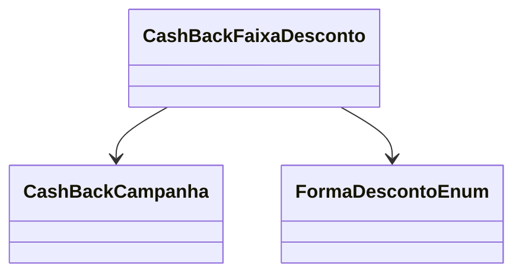

# CashBackFaixaDesconto
**Namespace**: IsthmusWinthor.Dominio.Entidades  
**Nome do Arquivo**: CashBackFaixaDesconto.cs  

## Visão Geral e Responsabilidade
A classe `CashBackFaixaDesconto` representa um componente do sistema de cashback que determina as faixas de desconto aplicáveis em uma campanha de cashback específica. Ela é responsável por armazenar as regras de desconto que são aplicadas com base em condições como valor mínimo de compra e a forma do desconto. O problema de negócio que ela resolve é a gestão de diferentes níveis de desconto que podem ser aplicados, proporcionando flexibilidade nas campanhas de cashback oferecidas aos clientes.

## Métodos de Negócio
N/A

## Propriedades Calculadas e de Validação
- `Desconto`: Valores atribuídos a esta propriedade devem respeitar a regra de que não pode ser menor que zero, garantindo que não existam faixas de desconto inválidas.
- `ValorMinimo`: Similarmente, esta propriedade deve validar que o valor mínimo de compra esteja sempre maior ou igual a zero.

## Navigations Property
- [CashBackCampanha](CashBackCampanha.md)

## Tipos Auxiliares e Dependências
- [FormaDescontoEnum](FormaDescontoEnum.md)

## Diagrama de Relacionamentos

---
Gerada em 29/12/2025 20:18:51
