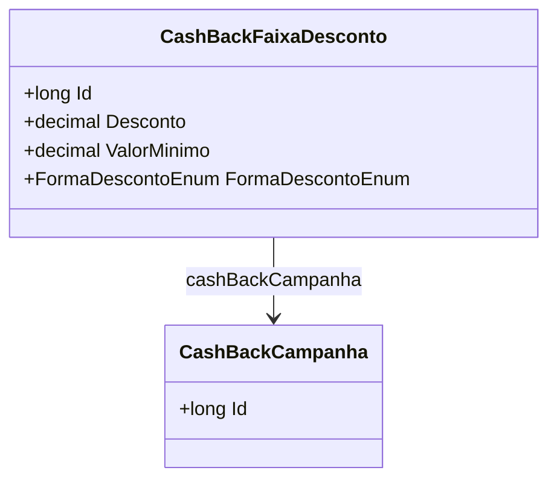

# CashBackFaixaDesconto
- **Namespace**: IsthmusWinthor.Dominio.Entidades
- **Nome do Arquivo**: CashBackFaixaDesconto.cs

## Visão Geral e Responsabilidade
A classe `CashBackFaixaDesconto` representa uma faixa de desconto aplicada em uma campanha de cashback. Ela visa solucionar a necessidade de definir as condições de acesso a descontos em um programa de fidelidade, garantindo que os usuários podem receber descontos em compras conforme critérios de valor mínimo e a forma de aplicação do desconto.

## Métodos de Negócio
*Nota: O código fornecido não contém métodos com lógica complexa, portanto não há métodos a serem documentados aqui.*

## Propriedades Calculadas e de Validação
- Não existem propriedades com lógica no `get` ou validações no `set` na класса CashBackFaixaDesconto.

## Navigation Property
- [CashBackCampanha](CashBackCampanha.md): Representa a campanha de cashback associada a esta faixa de desconto.

## Tipos Auxiliares e Dependências
- [FormaDescontoEnum](FormaDescontoEnum.md): Enum que define as formas de descontos aplicáveis.

## Diagrama de Relacionamentos

