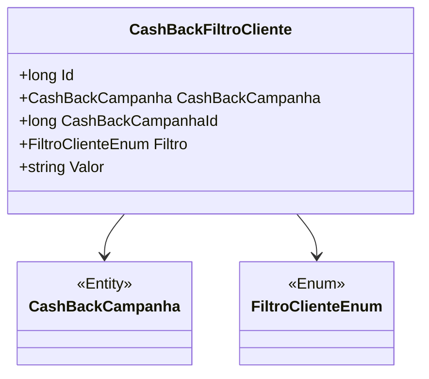

# CashBackFiltroCliente
**Namespace**: IsthmusWinthor.Dominio.Entidades  
**Nome do Arquivo**: CashBackFiltroCliente.cs  

## Visão Geral e Responsabilidade
A classe `CashBackFiltroCliente` representa um filtro associado a uma campanha de cashback. Ela desempenha um papel crucial na aplicação ao permitir a definição de critérios específicos para a aplicação de cashback baseado nas características dos clientes. Essa estrutura é essencial para garantir que as campanhas sejam direcionadas corretamente, aumentando a eficácia das ofertas e otimizando a experiência do cliente.

## Métodos de Negócio
Atualmente, a classe `CashBackFiltroCliente` não possui métodos de negócio com lógica complexa. Ela é utilizada principalmente para armazenar e gerenciar os dados relativos ao filtro de clientes.

## Propriedades Calculadas e de Validação
As propriedades da classe não incluem lógicas no `get` ou validações no `set`.

## Navigations Property
- [`CashBackCampanha`](CashBackCampanha.md): Representa a campanha de cashback associada ao filtro. 

## Tipos Auxiliares e Dependências
- [`FiltroClienteEnum`](FiltroClienteEnum.md): Enum que define os tipos de filtros aplicáveis aos clientes.

## Diagrama de Relacionamentos

