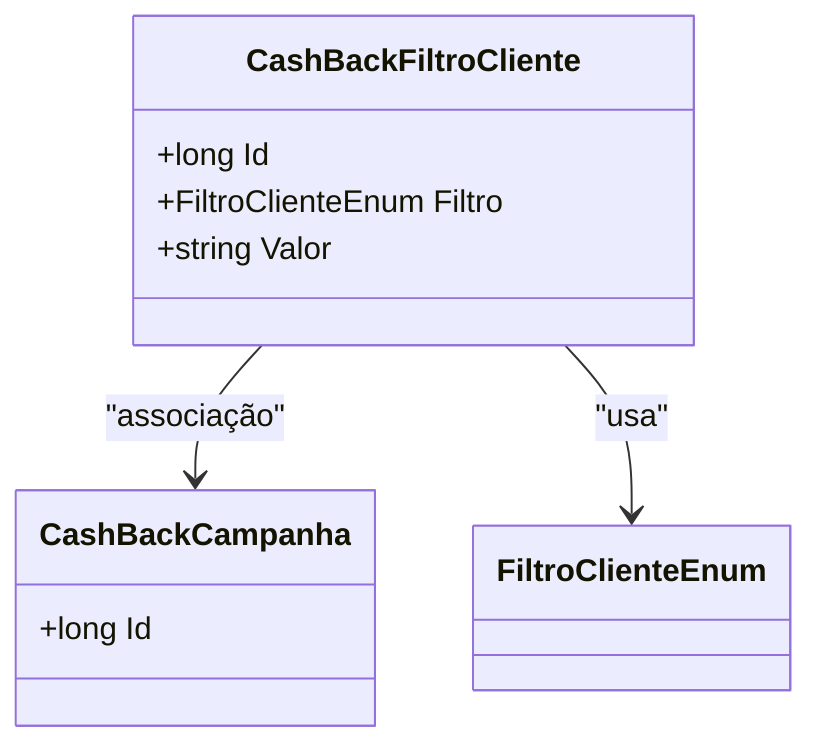

# CashBackFiltroCliente
**Namespace**: IsthmusWinthor.Dominio.Entidades  
**Nome do Arquivo**: CashBackFiltroCliente.cs  

## Visão Geral e Responsabilidade
A classe `CashBackFiltroCliente` atua como uma entidade no contexto de campanhas de cashback, permitindo a definição de filtros específicos aplicáveis aos clientes. Ela é responsável por armazenar informações relevantes sobre os critérios que determinam a elegibilidade dos clientes para receber cashback, resolvendo o problema de segmentação de clientes dentro da campanha.

## Métodos de Negócio
Não há métodos com lógica complexa a serem documentados nesta classe. Todos os métodos são simples, não apresentando lógica avançada.

## Propriedades Calculadas e de Validação
- Esta classe não possui propriedades com lógica no `get` ou validação no `set`.

## Navigations Property
- [CashBackCampanha](CashBackCampanha.md): Esta propriedade representa a campanha de cashback associada a este filtro.

## Tipos Auxiliares e Dependências
- [FiltroClienteEnum](FiltroClienteEnum.md): Enumerador que define os diferentes tipos de filtros que podem ser aplicados aos clientes nas campanhas de cashback.

## Diagrama de Relacionamentos

---
Gerada em 29/12/2025 20:18:58
