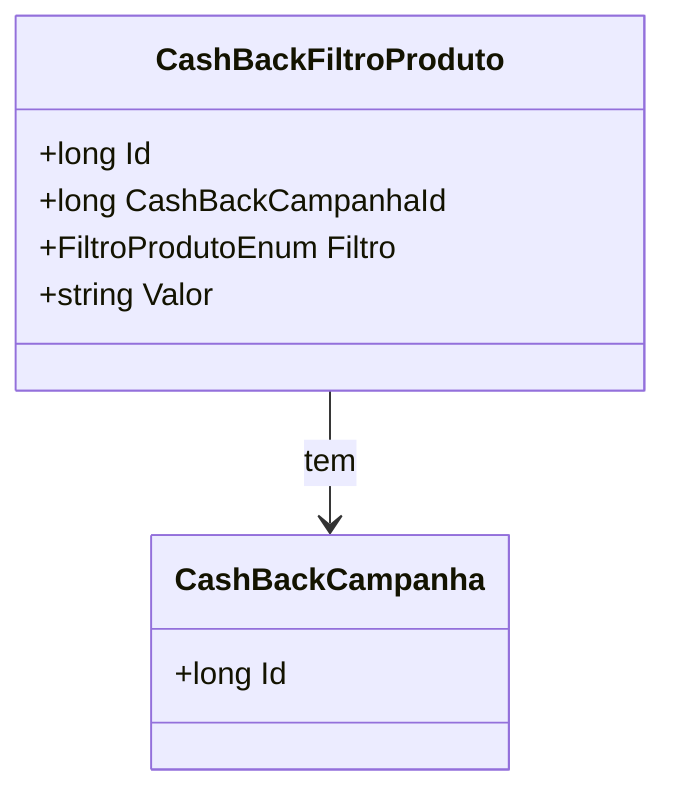

# CashBackFiltroProduto
**Namespace**: IsthmusWinthor.Dominio.Entidades  
**Nome do Arquivo**: CashBackFiltroProduto.cs  

## Visão Geral e Responsabilidade
A classe `CashBackFiltroProduto` representa um elemento de filtragem dentro de uma campanha de cashback no sistema. Ela é responsável por definir quais produtos são elegíveis para receber cashback de acordo com critérios específicos. Com isso, a classe permite que campanhas de cashback sejam configuradas de forma granular, ajustando as condições de filtragem dos produtos que podem participar da promoção.

## Propriedades Calculadas e de Validação
Atualmente, esta classe não possui propriedades que implementem lógica no `get` ou validações no `set`. Todas as propriedades são anêmicas, servindo apenas para transporte de dados.

## Navigations Property
- [CashBackCampanha](CashBackCampanha.md)

## Tipos Auxiliares e Dependências
- [FiltroProdutoEnum](FiltroProdutoEnum.md)

## Diagrama de Relacionamentos

---
Gerada em 29/12/2025 20:19:03
