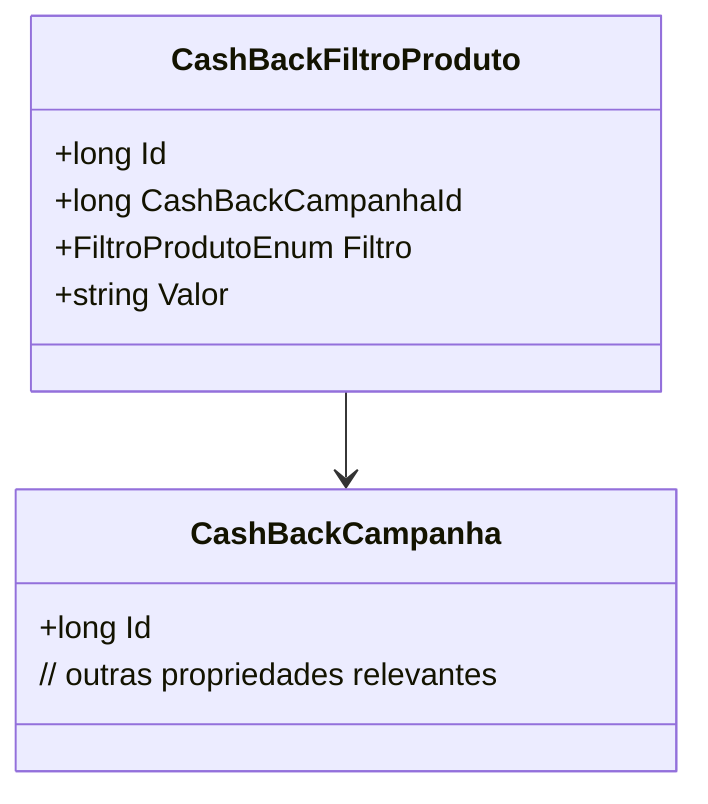

# CashBackFiltroProduto
**Namespace**: IsthmusWinthor.Dominio.Entidades  
**Nome do Arquivo**: CashBackFiltroProduto.cs

## Visão Geral e Responsabilidade
A classe `CashBackFiltroProduto` representa um filtro aplicado a uma campanha de cashback dentro do sistema. Seu papel é vincular critérios específicos de um produto com uma campanha de cashback, permitindo que o sistema determine quais produtos são elegíveis para ofertas especiais de retorno financeiro. Essa estrutura é crítica para a gestão de promoções e incentivos, gerando uma experiência mais direcionada ao usuário final.

## Métodos de Negócio
### N/A
Não há métodos de negócio complexos com lógica associada nesta classe.

## Propriedades Calculadas e de Validação
### N/A
Não existem propriedades com lógica de cálculo ou validação específica no `get` ou `set`.

## Navigations Property
- [CashBackCampanha](CashBackCampanha.md) - Representa a campanha de cashback associada a este filtro.

## Tipos Auxiliares e Dependências
- [FiltroProdutoEnum](FiltroProdutoEnum.md) - Enum utilizado para definir os diferentes tipos de filtros que podem ser aplicados no contexto de produtos elegíveis ao cashback.

## Diagrama de Relacionamentos

