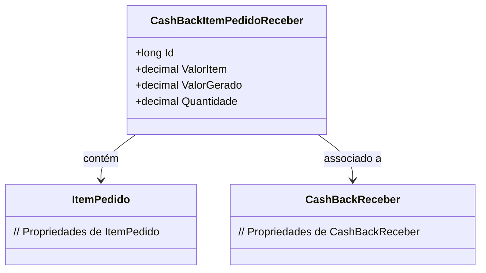

# CashBackItemPedidoReceber
**Namespace**: IsthmusWinthor.Dominio.Entidades  
**Nome do Arquivo**: CashBackItemPedidoReceber.cs  

## Visão Geral e Responsabilidade
A classe `CashBackItemPedidoReceber` representa um item relacionado ao recebimento de cashback em um pedido. Ela desempenha um papel crucial na gestão de pagamentos de cashback, assegurando que os valores correspondentes aos itens do pedido sejam corretamente rastreados e gerenciados. O problema de negócio que esta classe resolve é a necessidade de associar e calcular informações de cashback de forma precisa e eficiente, garantindo que os valores sejam atribuídos corretamente aos itens do pedido.

## Métodos de Negócio
Essa classe não contém métodos com lógica de negócio, focando apenas em armazenar o estado e as relações entre os objetos.

## Propriedades Calculadas e de Validação
- **ValorGerado**: Esta propriedade pode ser calculada com base em regras que definem como o cashback é gerado em relação ao valor do item e à quantidade. É importante garantir que o cashback gerado não ultrapasse limites definidos pela política da empresa.

## Navigations Property
- [ItemPedido](ItemPedido.md)
- [CashBackReceber](CashBackReceber.md)

## Tipos Auxiliares e Dependências
Nenhum enumerador ou classe estática/helper está diretamente associado a esta classe.

## Diagrama de Relacionamentos

---
Gerada em 29/12/2025 20:19:10
