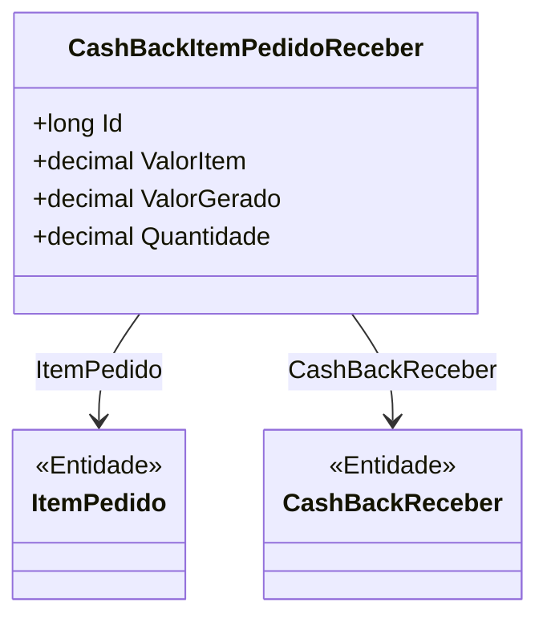

# CashBackItemPedidoReceber
**Namespace**: IsthmusWinthor.Dominio.Entidades  
**Nome do Arquivo**: CashBackItemPedidoReceber.cs  

## Visão Geral e Responsabilidade
A classe `CashBackItemPedidoReceber` representa um item de um pedido que gera um retorno financeiro para o cliente, conhecido como cashback. Este modelo de domínio é responsável por gerir as relações entre um item de pedido específico e o cashback a ser recebido, garantindo que o valor gerado seja corretamente associado ao item do pedido e às suas respectivas quantidades. O problema de negócio que esta classe resolve é o controle e a integração de informação entre pedidos e o sistema de cashback, permitindo uma gestão eficiente das recompensas aos clientes.

## Métodos de Negócio
Nenhum método com lógica de negócio foi identificado nesta classe.

## Propriedades Calculadas e de Validação
Nenhuma propriedade com lógica no `get` ou validação no `set` foi identificada nesta classe.

## Navigation Property
- [`ItemPedido`](ItemPedido.md): Representa o item associado ao pedido que gerou o cashback.
- [`CashBackReceber`](CashBackReceber.md): Representa a oportunidade de cashback a ser recebida associada a este item de pedido.

## Tipos Auxiliares e Dependências
Nenhum enumerador ou classe estática/helper foi identificado como utilizado nesta classe.

## Diagrama de Relacionamentos

