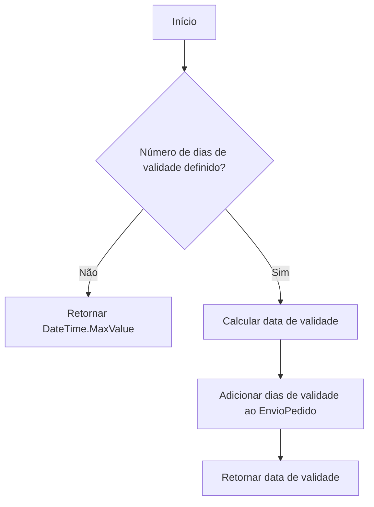
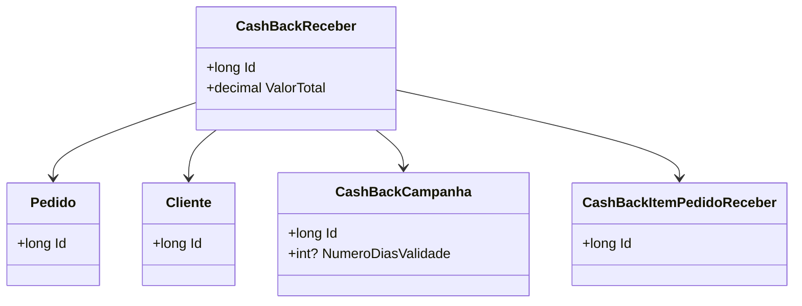

# CashBackReceber
**Namespace**: IsthmusWinthor.Dominio.Entidades  
**Nome do Arquivo**: CashBackReceber.cs  

## Visão Geral e Responsabilidade
A classe `CashBackReceber` representa uma entidade de sistema que gerencia o processo de recebimento de cashback por um cliente em relação a um pedido específico. Ela é responsável por garantir que a lógica de validade do cashback, associada a uma campanha específica, esteja corretamente aplicada, resolvendo assim o problema de assegurar que os clientes possam reivindicar o valor de cashback apenas dentro do período de validade definido.

## Métodos de Negócio

### Validade: Método Público
- **Objetivo**: Garante que o cashback está disponível para resgate apenas dentro do período de validade especificado pela campanha.
- **Comportamento**:
  1. Verifica se o número de dias de validade da `CashBackCampanha` está definido.
  2. Se não estiver definido, a validade do cashback é considerada como nunca expirando (`DateTime.MaxValue`).
  3. Caso contrário, calcula a data de validade, adicionando o número de dias de validade ao `EnvioPedido` do pedido associado.
  4. Retorna a data de validade do cashback.
- **Retorno**: A data que indica até quando o cashback pode ser resgatado. Se não houver uma data de validade definida, retorna uma data infinita.

## Propriedades Calculadas e de Validação
- **Validade**: A propriedade computa a data de validade do cashback considerando o envio do pedido e o número de dias de validade da campanha. A regra por trás do cálculo assegura que o cashback só possa ser reivindicado dentro de um tempo determinado, prevenindo resgates indevidos.

## Navigations Property
- **Pedido**: [Pedido](Pedido.md)
- **Cliente**: [Cliente](Cliente.md)
- **CashBackCampanha**: [CashBackCampanha](CashBackCampanha.md)
- **CashBackItensPedidoReceber**: [CashBackItemPedidoReceber](CashBackItemPedidoReceber.md)

## Tipos Auxiliares e Dependências
- **Enumeradores**:
  - [CashBackReceberStatus](CashBackReceberStatus.md)

## Diagrama de Relacionamentos

---
Gerada em 29/12/2025 20:19:22
