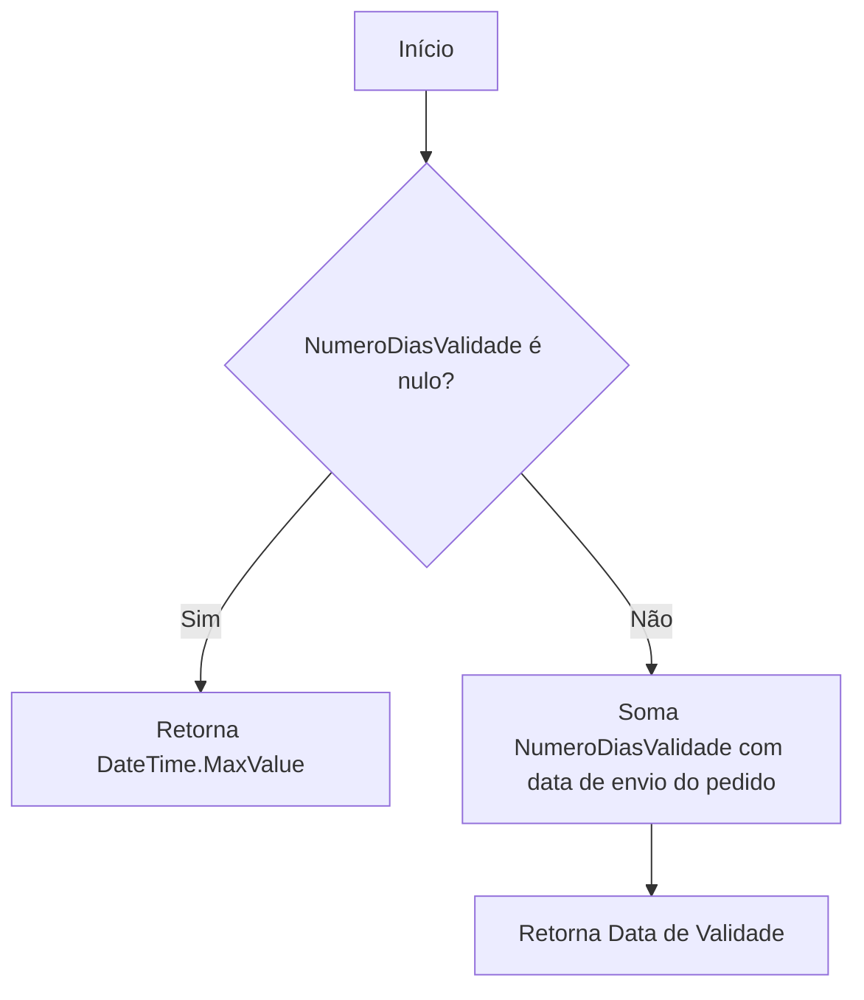
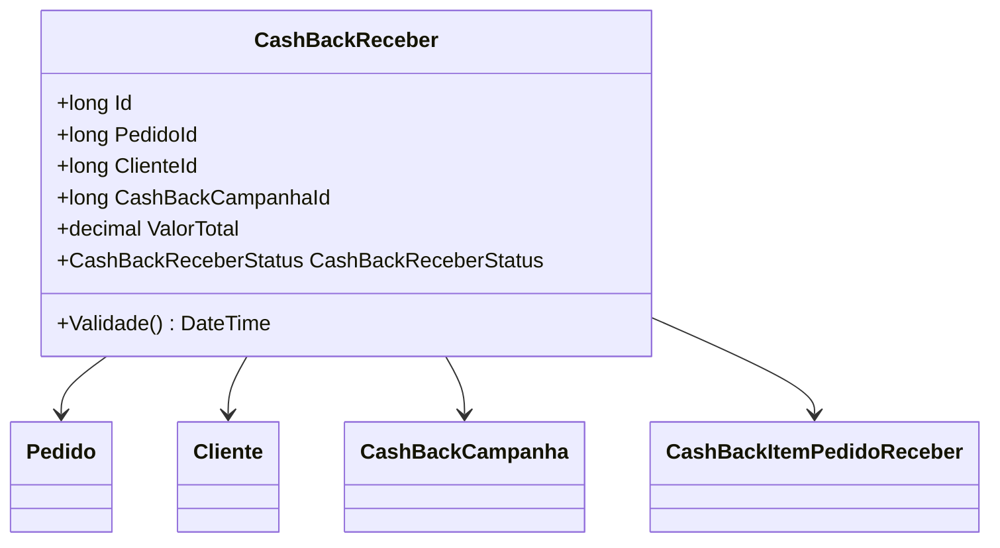

# CashBackReceber
**Namespace**: IsthmusWinthor.Dominio.Entidades  
**Nome do Arquivo**: CashBackReceber.cs  

## Visão Geral e Responsabilidade
A classe `CashBackReceber` representa uma entidade que é responsável pela gestão do cashback a ser recebido por um cliente após a realização de um pedido. Ela atende à necessidade de controle e acompanhamentos dos valores de cashback que os clientes podem reivindicar após uma compra, assegurando que as campanhas de cashback estejam sendo aplicadas corretamente.

## Métodos de Negócio

### Validade() - Público
- **Objetivo**: Este método garante que a data de validade do cashback esteja correta conforme os parâmetros da campanha de cashback associada ao pedido. Ele verifica se a campanha possui um prazo de validade definido.
- **Comportamento**:
  1. Verifica se a propriedade `NumeroDiasValidade` da `CashBackCampanha` é nula.
     - Se for nula, retorna `DateTime.MaxValue`, indicando que não há validade para o cashback.
  2. Se a validade é definida, calcula a data de validade somando o número de dias especificado à data de envio do pedido.
- **Retorno**: Retorna um `DateTime` representando a data limite em que o cashback pode ser reivindicado, ou `DateTime.MaxValue` se não houver uma data válida.

## Propriedades Calculadas e de Validação
- **Validade()**: Computa a data de validade do cashback com base na data de envio do pedido e na duração de validade da campanha.

## Navigations Property
- [Pedido](Pedido.md)
- [Cliente](Cliente.md)
- [CashBackCampanha](CashBackCampanha.md)
- [CashBackItemPedidoReceber](CashBackItemPedidoReceber.md)

## Tipos Auxiliares e Dependências
- `[CashBackCampanhaStatus](CashBackCampanhaStatus.md)`: Enumerador para o status do cashback.
- `[CashBackReceberStatus](CashBackReceberStatus.md)`: Representa os diferentes estados do recebimento do cashback.

## Diagrama de Relacionamentos

