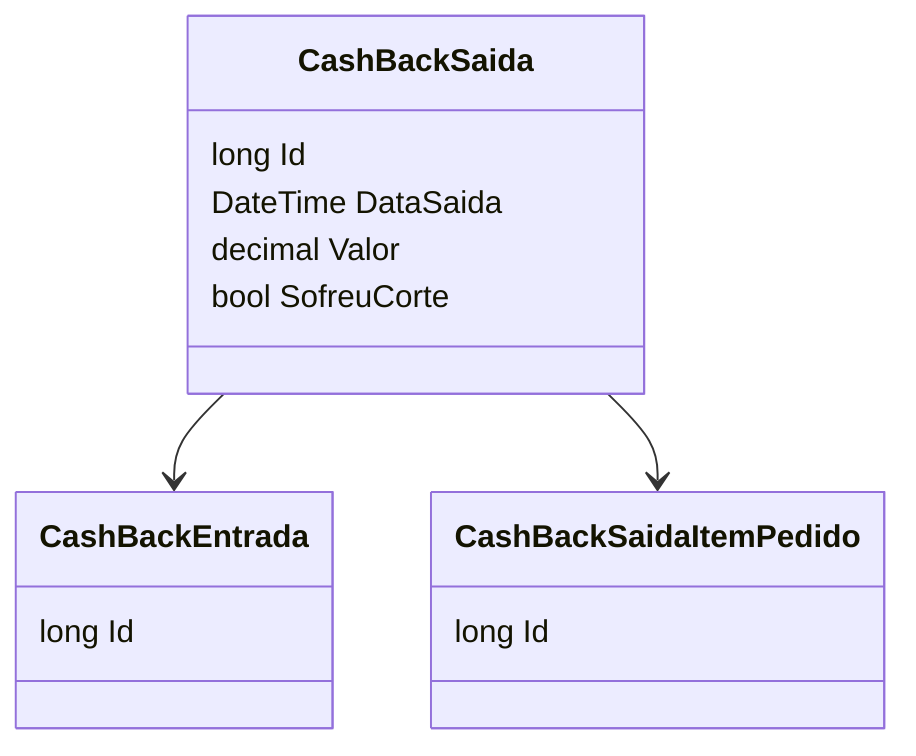

# CashBackSaida
- **Namespace**: IsthmusWinthor.Dominio.Entidades
- **Nome do Arquivo**: CashBackSaida.cs

## Visão Geral e Responsabilidade
A classe `CashBackSaida` representa uma saída de cash back associada a uma entrada específica de cash back. Ela é responsável por gerenciar as saídas de valores que podem ocorrer, especialmente em um contexto onde os cash backs são aplicados em transações de vendas. Este modelo é crucial para garantir que os registros financeiros reflitam corretamente as operações de cash back realizadas, assegurando um controle adequado de entradas e saídas conforme as regras de negócio estabelecidas.

## Métodos de Negócio
### Título: **N/A** (A classe não possui métodos de negócio definidos no código fornecido)
### Objetivo: N/A
### Comportamento: N/A
### Retorno: N/A

## Propriedades Calculadas e de Validação
- **SofreuCorte**: Esta propriedade indica se a saída de cash back sofreu algum corte. A lógica de implementação garante que as saídas de cash back sejam registradas corretamente, estabelecendo se houve ou não restrições aplicadas a essa saída.
  
## Navigations Property
- [CashBackEntrada](CashBackEntrada.md): Esta propriedade representa a entrada de cash back associada, permitindo o rastreamento da origem do cash back.
- [CashBackSaidaItemPedido](CashBackSaidaItemPedido.md): Esta coleção contém os itens de pedido associados a essa saída de cash back, permitindo um controle detalhado das transações.

## Tipos Auxiliares e Dependências
- **Enums**: N/A
- **Classes Estáticas/Helpers**: N/A

## Diagrama de Relacionamentos

---
Gerada em 29/12/2025 20:19:31
