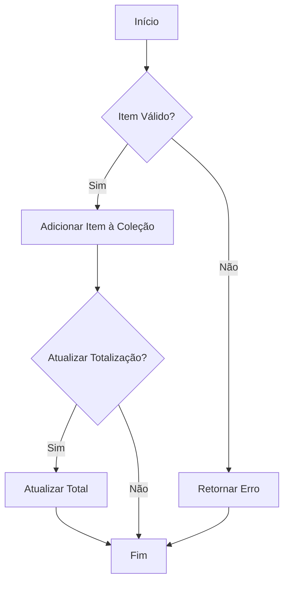
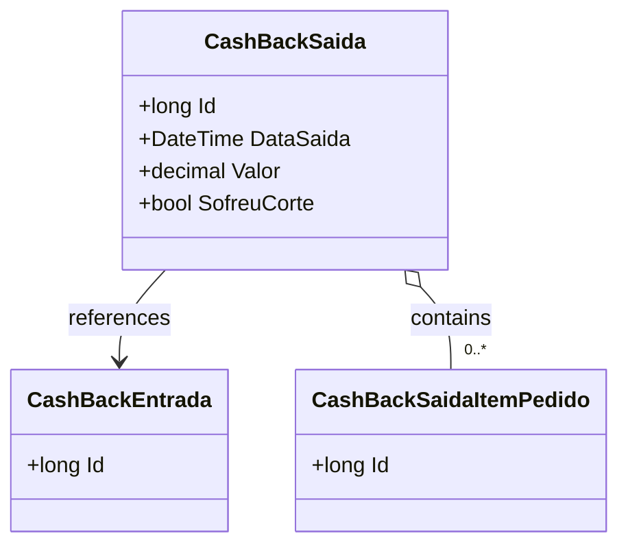

# CashBackSaida
**Namespace**: IsthmusWinthor.Dominio.Entidades  
**Nome do Arquivo**: CashBackSaida.cs  

## Visão Geral e Responsabilidade
A classe `CashBackSaida` representa uma saída de cashback no sistema, associando valores que foram disponibilizados a partir de entradas de cashback. Sua principal responsabilidade é gerenciar as saídas relacionadas a um cashback específico, registrando informações como data de saída, valor da transação e status de corte no cashback. Esta classe é crucial para garantir a integridade dos dados financeiros associados ao cashback, permitindo uma melhor gestão e rastreamento das transações de saída.

## Métodos de Negócio

### Título: `AddCashBackSaidaItem` (Visibilidade: `public`)
- **Objetivo**: Garante que os itens da saída de cashback sejam corretamente associados e registrados dentro da transação de saída.
- **Comportamento**: 
    1. Verifica se o item é válido e se a saída de cashback aceita novos itens.
    2. Se a validação passar, adiciona o item à coleção de `CashBackSaidaItensPedidos`.
    3. Atualiza a totalização da saída de cashback, se necessário.
- **Retorno**: Retorna uma confirmação do sucesso da operação ou um erro caso a adição falhe.

### VISUALIZAÇÃO:

## Propriedades Calculadas e de Validação
- **SofreuCorte**: Esta propriedade indica se a saída de cashback sofreu um corte. A lógica de controle de fluxo e validade de dados é aplicada para garantir que apenas as saídas que passaram pelo processo de corte sejam marcadas como tal.

## Navigations Property
- `[CashBackEntrada](CashBackEntrada.md)`: Representa a entrada de cashback associada a esta saída.
- `[CashBackSaidaItemPedido](CashBackSaidaItemPedido.md)`: Representa os itens de pedidos relacionados a esta saída de cashback.

## Tipos Auxiliares e Dependências
- [IEntidade](IEntidade.md): Interface que esta classe implementa para ser reconhecida como uma entidade do domínio.

## Diagrama de Relacionamentos

