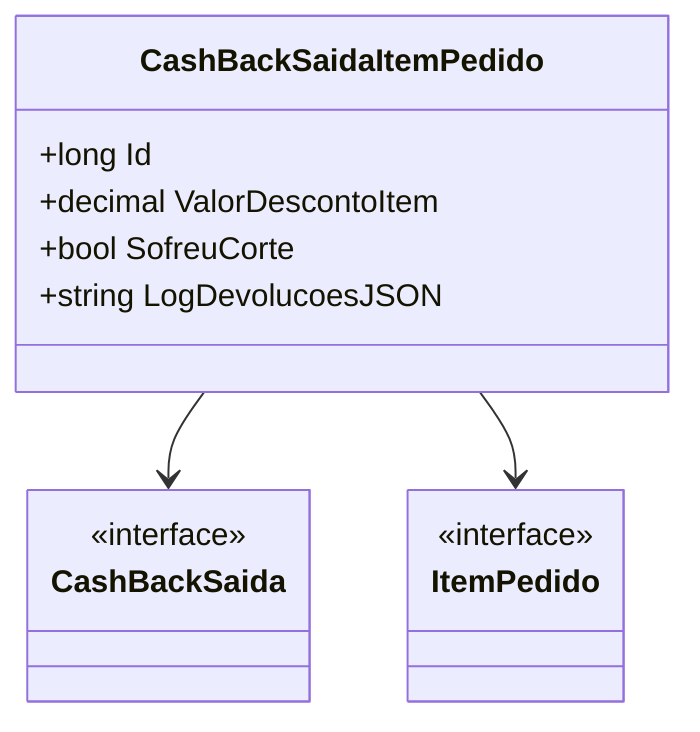

# CashBackSaidaItemPedido
**Namespace**: IsthmusWinthor.Dominio.Entidades  
**Nome do Arquivo**: CashBackSaidaItemPedido.cs  

## Visão Geral e Responsabilidade
A classe `CashBackSaidaItemPedido` representa um item de pedido que está associado a um reembolso de cashback. Sua responsabilidade principal é monitorar quais itens de um pedido receberam descontos através do cashback e registrar qualquer impacto deste processo, como cortes ou devoluções. Essa classe é fundamental no controle financeiro, garantindo a integridade e rastreabilidade dos benefícios oferecidos ao cliente.

## Métodos de Negócio
Atualmente, a classe fornecida não contém métodos definidos. Portanto, a documentação sobre métodos de negócio não se aplica.

## Propriedades Calculadas e de Validação
A classe `CashBackSaidaItemPedido` contém as seguintes propriedades de dados que não parecem incluir lógica complexa de validação ou cálculo:

- `ValorDescontoItem`: Representa o valor do desconto aplicado ao item. A regra de negócio aqui envolve garantir que esse valor esteja correto em relação ao cashback disponível e ao total do pedido.

## Navigations Property
- `CashBackSaida`: [CashBackSaida](CashBackSaida.md) - Representa o reembolso de cashback vinculado ao item de pedido.
- `ItemPedido`: [ItemPedido](ItemPedido.md) - Representa o item de pedido ao qual o cashback se relaciona.

## Tipos Auxiliares e Dependências
- Não há enumeradores ou classes estáticas/helpers listadas na classe `CashBackSaidaItemPedido` que sejam diretamente visíveis.

## Diagrama de Relacionamentos

---
Gerada em 29/12/2025 20:19:39
