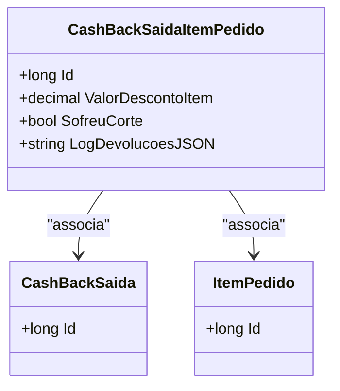

# CashBackSaidaItemPedido
**Namespace**: IsthmusWinthor.Dominio.Entidades  
**Nome do Arquivo**: CashBackSaidaItemPedido.cs  

## Visão Geral e Responsabilidade
A classe `CashBackSaidaItemPedido` representa um item específico dentro de uma operação de cashback, associando um item de pedido a uma saída de cashback. Esta classe atua principalmente na gestão das informações relacionadas ao valor do desconto aplicado em itens de pedidos na forma de cashback e auxilia na documentação dos cortes e alterações feitas no cashback desses itens. O objetivo de negócio que a classe resolve é garantir que as transações de cashback sejam precisas e registradas de forma adequada, permitindo um acompanhamento efetivo das compensações financeiras.

## Métodos de Negócio
*Não foram identificados métodos com lógica complexa ou regras de negócios implementadas na classe `CashBackSaidaItemPedido`. A classe consiste predominante de propriedades que armazenam dados.*

## Propriedades Calculadas e de Validação
- `ValorDescontoItem`: Essa propriedade armazena o valor do desconto aplicado ao item. Não foi identificada lógica complexa em seu getter ou setter, mas seu valor deve ser validado em contextos de negócio para garantir que não ultrapasse o valor do item original.
- `SofreuCorte`: Esta propriedade indica se o item sofreu um "corte" no valor do cashback. A lógica que determina o estado desta propriedade deve ser gerida através de regras de negócio em uma camada superior, mas ela armazena um estado crucial do processo que pode afetar o cálculo final do cashback.

## Navigations Property
- `[CashBackSaida](CashBackSaida.md)`: Representa a saída de cashback associada a este item de pedido.
- `[ItemPedido](ItemPedido.md)`: Representa o item de pedido ao qual este cashback se refere.

## Tipos Auxiliares e Dependências
- Este documento não identifica dependências de tipos auxiliares específicos como enums ou helpers neste contexto atual.

## Diagrama de Relacionamentos

Este diagrama oferece uma visão clara das relações de associação entre a classe `CashBackSaidaItemPedido` e as classes `CashBackSaida` e `ItemPedido`, evidenciando como os itens de pedido se inter-relacionam dentro do contexto de uma operação de cashback.
