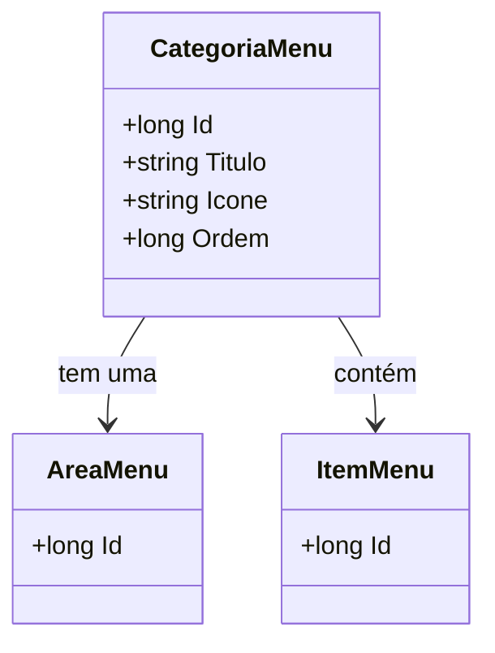

# CategoriaMenu
**Namespace**: IsthmusWinthor.Dominio.Entidades  
**Nome do Arquivo**: CategoriaMenu.cs  

## Visão Geral e Responsabilidade
A classe `CategoriaMenu` representa uma categoria dentro de um sistema de menus, sendo responsável por organizar itens de menu relacionados e suas respectivas áreas. Ela permite a estruturação da interface do usuário, onde cada categoria pode conter múltiplos itens de menu, e a ordenação das categorias e itens dentro da área de menu. Isso resolve o problema de navegação e usabilidade, permitindo fácil acesso a funcionalidades agrupadas.

## Métodos de Negócio
Não existem métodos com lógica significativa a serem descritos nesta classe.

## Propriedades Calculadas e de Validação
Não há propriedades que contenham lógica no `get` ou validação no `set`.

## Navigations Property
- [AreaMenu](AreaMenu.md)
- [ItemMenu](ItemMenu.md)

## Tipos Auxiliares e Dependências
Não há enumeradores ou classes estáticas utilizadas diretamente pela classe `CategoriaMenu`.

## Diagrama de Relacionamentos

---
Gerada em 29/12/2025 20:19:46
