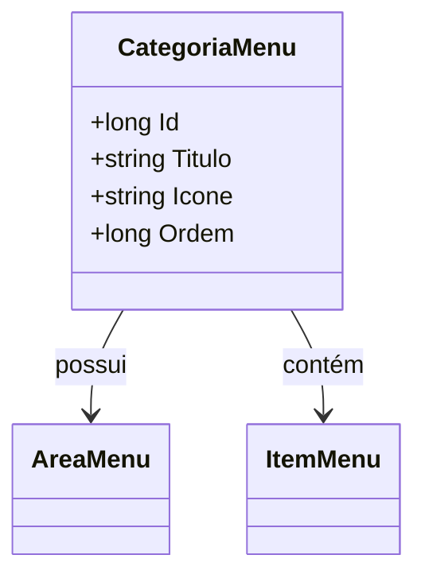

# CategoriaMenu
**Namespace**: IsthmusWinthor.Dominio.Entidades  
**Nome do Arquivo**: CategoriaMenu.cs  

## Visão Geral e Responsabilidade
A classe `CategoriaMenu` representa uma categoria dentro de um sistema de menu, crucial para a organização e hierarquização dos itens que compõem uma interface de usuário. Sua principal função é agrupar itens de menu sob um título e um ícone específico, facilitando a navegação e a usabilidade do aplicativo. Essa estrutura permite que diferentes áreas de um menu sejam delimitadas, oferecendo uma experiência mais intuitiva ao usuário final.

## Métodos de Negócio
Atualmente, a classe `CategoriaMenu` não possui métodos com lógica de negócio que vão além de simples getters e setters. Portanto, não há métodos a serem documentados nesta seção.

## Propriedades Calculadas e de Validação
- **Ordem**: A propriedade `Ordem` deve ser utilizada para definir a ordem de apresentação da categoria no menu. A lógica envolve assegurar que os valores atribuídos respeitem uma sequência única entre as categorias.

## Navigations Property
- [`AreaMenu`](AreaMenu.md): Representa a área de menu à qual a categoria pertence, estabelecendo uma ligação direta com a estrutura do menu principal.
- [`ItensMenu`](ItemMenu.md): Uma coleção de itens de menu que pertencem a esta categoria, permitindo acesso e organização dos elementos do menu.

## Tipos Auxiliares e Dependências
- `IEntidade`: Interface que define a entidade e suas características.
- Nenhum enumerador ou classe estática relevante foi identificado neste contexto.

## Diagrama de Relacionamentos

