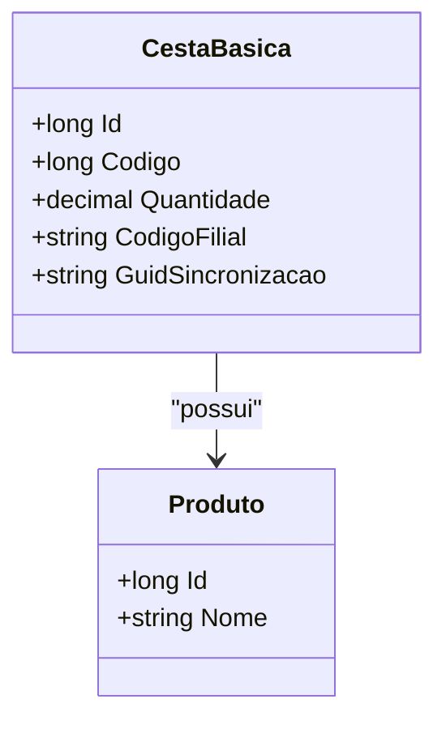

# CestaBasica
**Namespace**: IsthmusWinthor.Dominio.Entidades  
**Nome do Arquivo**: CestaBasica.cs

## Visão Geral e Responsabilidade
A classe `CestaBasica` representa uma entidade no domínio de um sistema de gestão de cestas básicas. Sua responsabilidade principal é modelar a composição de uma cesta básica, incluindo um produto específico, sua quantidade e informações adicionais relevantes para o sistema, como o código da filial e um identificador de sincronização. Esse modelo é fundamental para garantir que as cestas básicas sejam gerenciadas de forma adequada e que as informações sobre os produtos e suas quantidades estejam sempre disponíveis e consistentemente atualizadas. 

## Métodos de Negócio
Não há métodos de negócio a serem documentados, pois a classe se limita a descrever suas propriedades.

## Propriedades Calculadas e de Validação
Não há propriedades calculadas ou de validação definidas no `get` ou `set` na classe `CestaBasica`.

## Navigation Property
- [Produto](Produto.md)

## Tipos Auxiliares e Dependências
Não há enumeradores ou classes auxiliares sendo utilizadas diretamente na classe `CestaBasica`.

## Diagrama de Relacionamentos

---
Gerada em 29/12/2025 20:19:53
